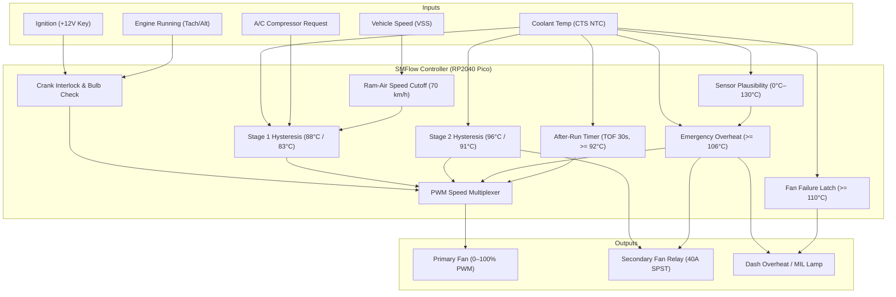

# Standalone Electric Cooling Fan Controller (EF-ECU) — Technical Architecture

This document specifies the technical architecture, electrical interfaces, thermodynamics, control algorithms, functional safety requirements, and fail-safe state machines for an SMFlow-based **Electric Cooling Fan Electronic Control Unit (EF-ECU)** designed for high-performance restomods, classic muscle cars, and hot rods.

---

## 1. Executive Summary & Engineering Context

When retrofitting modern high-power crate engines (e.g., Chevrolet Performance LS3/LT4, Ford Coyote 5.0, Mopar 392 Apache Hemi, or built Big Block Chevy 454/502) into classic vehicle chassis:

- **Mechanical fans are physically unsuitable**: Engine setback, thick aftermarket aluminum crossflow radiators, serpentine belt drives, and aftermarket air conditioning compressors eliminate clearance for bulky mechanical water-pump-mounted clutch fans.
- **Parasitic load penalties**: A typical 18-inch steel or nylon mechanical clutch fan consumes up to 22 kW (30 hp) at 6,000 engine RPM due to air drag, penalizing quarter-mile acceleration and dynamometer numbers.
- **Cooling at idle**: High-compression hot rods idle at 750–850 RPM with aggressive camshaft overlaps, generating high thermal loads while mechanical water pumps and clutch fans spin at their absolute lowest volumetric airflow capacity.
- **Electrical power management**: Swapping to high-capacity electric fans introduces massive electrical transients. Two 14-inch high-output fans draw up to 70 A combined continuous current, with locked-rotor inductive inrush exceeding 150 A if triggered together.

The **EF-ECU** delivers progressive pulse-width modulation (PWM) soft-start, staged secondary fan relay actuation, condenser head pressure compensation, highway ram-air suppression, and battery-protected post-shutdown rundown cooling.



---

## 2. Electrical System & Interface Specification

### 2.1 Hardware Schematic & Signal Conditioning

```
[ VEHICLE ELECTRICAL HARNESS ]                            [ SMFlow RP2040 Pico ]

+12V Switched Ignition ───[ 10k ]───┬──────────────────────────► GP14 (DI)
                                    │
                                 [ 3.3k ]
                                    │
                                   GND (via 3.3V Zener Clamp)

Engine Run (Tach / Alt) ──[ 10k ]───┬──────────────────────────► GP15 (DI)
                                    │
                                 [ 3.3k ]
                                    │
                                   GND

A/C Request (+12V Clutch) ─[ 10k ]──┬──────────────────────────► GP13 (DI)
                                    │
                                 [ 3.3k ]
                                    │
                                   GND

+3.3V Ref ─────────────[ 2.49k 1% ]─┬──────────────────────────► GP26 (ADC0)
                                    │
Delphi 2-Pin CTS (NTC) ─────────────┴───► GND (Sensor Return)

VSS Pulse Converter (0–3.3V F-to-V) ──────────────────────────► GP27 (ADC1)

GP16 (PWM) ────────────[ 100R ]─────────► High-Power Solid-State PWM Module ──► Fan 1 Motor
GP17 (DO)  ────────────[ 100R ]─────────► IRLZ44N Logic N-FET ──► 40A Relay ──► Fan 2 Motor
GP18 (DO)  ────────────[ 100R ]─────────► 2N7002 N-FET ────────► Dash Cluster Warning Lamp
```

### 2.2 Terminal Interface Characteristics

| Pin | Logical Name | Signal Type | Electrical Specification | Automotive Circuitry |
| :---: | :---: | :---: | :---: | :--- |
| **GP14** | `Ignition` | Digital Input | 0 V = Off, 3.3 V = Run/Acc | Resistor divider ($10\text{ k}\Omega / 3.3\text{ k}\Omega$) with SMAJ15A TVS diode and $0.1\ \mu\text{F}$ debounce capacitor. |
| **GP15** | `EngineRun` | Digital Input | 0 V = Stopped, 3.3 V = Running | Optocoupler or divider tapped from alternator stator terminal (W-terminal), tachometer square-wave, or fuel pump relay bus. |
| **GP13** | `AcRequest` | Digital Input | 0 V = A/C Off, 3.3 V = A/C Demanded | Connected to cockpit A/C thermostat switch or binary/trinary refrigerant high-pressure switch (+12V clutch request line). |
| **GP26** | `CoolantTemp` | Analog Input | 0.0 V to 3.3 V (ADC0) | Connected to GM Delphi 12146312 coolant temperature sensor with a $2.49\text{ k}\Omega\pm 0.1\%$ pull-up resistor to clean 3.3 V analog reference. |
| **GP27** | `VehicleSpeed` | Analog Input | 0.0 V to 3.3 V (ADC1) | Output from transmission Vehicle Speed Sensor (VSS) frequency-to-voltage converter or Dakota Digital GPS speed interface. $0.0\text{ V} = 0\text{ km/h}$, $3.0\text{ V} = 150\text{ km/h}$. |
| **GP16** | `Fan1Pwm` | PWM Output | 3.3 V logic PWM (20 kHz) | Drives solid-state automotive PWM module (e.g. C6 Corvette GM Part # 25866171, Mitsubishi, or Spal Brushless PWM interface). |
| **GP17** | `Fan2Relay` | Digital Output | 3.3 V logic high | Drives logic-level N-FET (IRLZ44N / IRF3708) with $1\text{N}4007$ flyback diode across the coil of a 40 A Bosch-style sealed SPST relay. |
| **GP18** | `WarningOutput`| Digital Output | 3.3 V logic high | Low-side N-FET (2N7002) switching instrument cluster warning lamp or piezo buzzer to ground. |

---

## 3. Aerodynamics, Thermodynamics & Ram-Air Control

### 3.1 Radiator Airflow Mechanics

Total radiator mass airflow $\dot{m}_{\text{air}}$ is the sum of fan-forced airflow and aerodynamic vehicle ram-air:

$$\dot{m}_{\text{air}} = \dot{m}_{\text{fan}} + C_{\text{grille}} \cdot A_{\text{rad}} \cdot \rho_{\text{air}} \cdot v_{\text{vehicle}}$$

Where:
- $A_{\text{rad}}$ is the frontal core area ($\approx 0.35\ \text{m}^2$).
- $C_{\text{grille}}$ is the frontal vehicle grille recovery factor ($\approx 0.65$ in classic muscle cars).
- $\rho_{\text{air}}$ is ambient air density ($1.204\ \text{kg/m}^3$ at 20°C).
- $v_{\text{vehicle}}$ is vehicle forward speed.

At speeds above **70 km/h (43.5 mph)**:
- Aerodynamic ram air exceeds **2,400 CFM** through the core.
- The electric fans (rated for ~1,600 CFM each) produce lower flow velocity than the oncoming air stream.
- Running fan blades at high vehicle speed creates aerodynamic restriction ("fan stalling"), generates unnecessary stator heat, wears out brushed motors, and draws 30+ amps from the alternator without thermal benefit.
- The controller therefore **suppresses Stage 1 and A/C fan requests above 70 km/h**.
- If coolant reaches Stage 2 (**96°C**) or Emergency (**106°C**) under heavy load (such as hill climbing or towing), the speed cutoff is bypassed.

### 3.2 A/C Condenser Thermal Rejection

The refrigerant condenser sits directly in front of the engine radiator. When the driver engages air conditioning:
- High-side refrigerant pressure rises rapidly from **100 psi to 300+ psi** within seconds if airflow is absent.
- The condenser radiates heat into the incoming air before it reaches the radiator.
- The controller commands **Stage 1 (50% PWM)** immediately upon `AcRequest == true` below highway speeds, maintaining high-side head pressure within safe operating envelopes (175–225 psi) and preventing compressor high-pressure cutout.

### 3.3 Post-Shutdown Heat Soak & Battery Power Budget

When a hot cast-iron or aluminum engine is shut down:
- The mechanical engine-driven water pump ceases coolant circulation.
- Trapped combustion heat conducts into stagnant cylinder head water jackets, causing local coolant temperature to spike by up to 20°C within 180 seconds.
- Thermo-siphon action moves buoyant hot coolant into the top tank of the radiator.

Running **Fan 1 at 50% PWM** for **30 seconds**:
- Consumes only:
  $$I_{\text{avg}} = 0.50 \times 25\text{ A} = 12.5\text{ A}$$
  $$Q_{\text{discharge}} = 12.5\text{ A} \times \frac{30\text{ s}}{3,600\text{ s/h}} \approx 0.104\text{ Ah}$$
- An average automotive starting battery has a capacity of 50 to 75 Ah. A discharge of 0.1 Ah represents less than **0.2% of battery reserve**, while dramatically reducing radiator pressure and heat soak.
- If coolant cools below **83°C**, after-run terminates early, conserving remaining electrical energy.

---

## 4. State Machine & Regulation Strategy

```mermaid
stateDiagram-v2
    [*] --> KeyOff: Ignition = false

    state KeyOff {
        [*] --> IdleCold
        IdleCold --> AfterRunCooldown: Ignition goes false & Temp >= 92°C
        AfterRunCooldown --> IdleCold: Timeout (30s) or Temp < 83°C
    }

    KeyOff --> BulbCheck: Ignition = true & EngineRun = false

    state BulbCheck {
        note: Fans locked OFF, Warning Lamp ON
    }

    BulbCheck --> RunningNormal: EngineRun = true & Temp < 88°C
    KeyOff --> RunningNormal: Ignition = true & EngineRun = true

    state RunningNormal {
        [*] --> Warmup: Temp < 88°C
        Warmup --> Stage1: Temp >= 88°C (Speed < 70 km/h)
        Warmup --> Stage1: AcRequest = true (Speed < 70 km/h)
        Stage1 --> Warmup: Temp < 83°C & AcRequest = false
        Stage1 --> HighwaySuppressed: Speed >= 70 km/h & Temp < 96°C
        HighwaySuppressed --> Stage1: Speed < 70 km/h

        Stage1 --> Stage2: Temp >= 96°C
        HighwaySuppressed --> Stage2: Temp >= 96°C
        Stage2 --> Stage1: Temp < 91°C
    }

    RunningNormal --> EmergencyOverheat: Temp >= 106°C or Sensor Fault
    BulbCheck --> EmergencyOverheat: Temp >= 106°C or Sensor Fault

    state EmergencyOverheat {
        note: Fan 1 = 100%, Fan 2 = ON, Warning Lamp = ON
    }

    EmergencyOverheat --> FanFailureLatched: Temp >= 110°C & Stage 2 active

    state FanFailureLatched {
        note: Warning Lamp LATCHED until key-off
    }

    FanFailureLatched --> KeyOff: Ignition = false
    EmergencyOverheat --> RunningNormal: Temp < 106°C & Sensor OK
    RunningNormal --> KeyOff: Ignition = false
```

---

## 5. Functional Safety & Fail-Safe Diagnostics

| Fault Condition | Detection Logic | Safety Action | Recovery Mechanism |
| :--- | :--- | :--- | :--- |
| **NTC Sensor Short-to-Ground** | `CoolantTemp < 0.0°C` | Force Fan 1 = 100%, Fan 2 = ON, WarningOutput = ON. | Automatic once signal returns to $0.0^\circ\text{C} \le T \le 130.0^\circ\text{C}$. |
| **NTC Sensor Open-Circuit** | `CoolantTemp > 130.0°C` | Force Fan 1 = 100%, Fan 2 = ON, WarningOutput = ON. | Automatic once signal returns within bounds. |
| **Critical Engine Overheat** | `CoolantTemp >= 106.0°C` | Bypasses speed lockout; both fans 100% full blast; WarningOutput ON. | Hysteresis reduction below 106.0°C. |
| **Thermal Runaway / Fan Failure** | `CoolantTemp >= 110.0°C` while Stage 2 commanded active | Trips latched fan failure alarm (`latch_fan_fail`); dash warning lamp ON. | Latched until Ignition is cycled OFF. |
| **Starter Motor Cranking** | `Ignition == true` AND `EngineRun == false` | Disables both fan outputs; illuminates bulb-check lamp. | Automatically enters normal regulation once engine starts. |
| **Ignition Cutoff** | `Ignition == false` | Evaluates after-run cooldown condition; shuts down all high-power loads. | Normal shutdown. |

---

## 6. Bench Commissioning & Calibration Guide

### 6.1 CTS Sensor Resistance Calibration
For a standard GM Delphi 2-pin coolant sensor with a $2.49\text{ k}\Omega$ pull-up to 3.3 V:

$$V_{\text{pin}} = 3.3\text{ V} \times \frac{R_{\text{NTC}}}{R_{\text{NTC}} + 2490\ \Omega}$$

| Coolant Temperature | $R_{\text{NTC}}$ Nominal | ADC Voltage ($V_{\text{pin}}$) | Controller Mode |
| :---: | :---: | :---: | :--- |
| **0°C (32°F)** | $9,420\ \Omega$ | 2.61 V | Sensor Lower Plausibility Limit |
| **20°C (68°F)** | $3,520\ \Omega$ | 1.93 V | Cold Engine |
| **83°C (181°F)** | $410\ \Omega$ | 0.47 V | Stage 1 Cut-Out Setpoint |
| **88°C (190°F)** | $345\ \Omega$ | 0.40 V | Stage 1 Cut-In Setpoint |
| **91°C (196°F)** | $310\ \Omega$ | 0.37 V | Stage 2 Cut-Out Setpoint |
| **96°C (205°F)** | $265\ \Omega$ | 0.32 V | Stage 2 Cut-In Setpoint |
| **106°C (223°F)** | $195\ \Omega$ | 0.24 V | Emergency Overheat Setpoint |
| **110°C (230°F)** | $175\ \Omega$ | 0.22 V | Critical Alarm / Fan Failure Limit |
| **130°C (266°F)** | $110\ \Omega$ | 0.14 V | Sensor Upper Plausibility Limit |

### 6.2 Electrical Noise Suppression
1. **Flyback Diodes**: Always install a fast recovery or standard 3 A diode (e.g. 1N5408) across the Fan 2 relay coil and motor terminals.
2. **Solid-State PWM Driver**: Ensure the PWM ground return connects directly to the vehicle chassis or battery negative, never through the logic ground trace of the RP2040.
3. **Sensor Grounding**: The Delphi CTS ground wire must return directly to the controller's analog ground pin, avoiding high-current ground loops from alternator or fan return currents.
