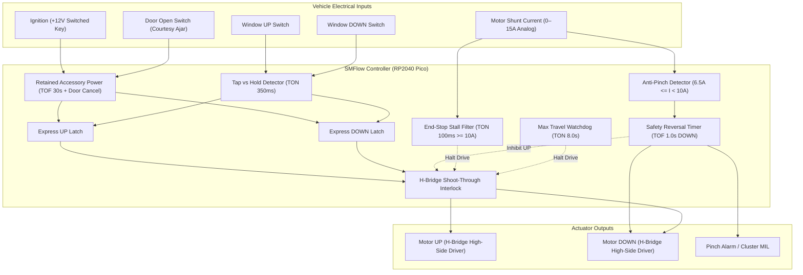
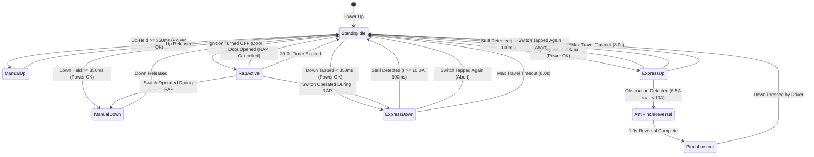

# Standalone Power Window Controller Module (WCM) — Technical Architecture

This document specifies the technical architecture, motor current sensing physics, FMVSS 118 / UN ECE-R21 anti-pinch compliance, H-bridge electrical interfaces, and multi-window modular expansion patterns for an SMFlow-based **Automotive Power Window Control Module (WCM)**.

---

## 1. Executive Summary & Engineering Context

Power window automation is one of the most sought-after electrical upgrades for classic car restomods, custom trucks, kit vehicles, and commercial repowers. Factory manual crank windows or crude aftermarket toggle switch kits suffer from severe limitations:
- **No One-Touch Express Operation**: Drivers must hold the switch for 4 to 6 seconds to lower or raise glass, causing distracted driving.
- **Extreme Pinch Injury Hazard**: Without electronic obstruction detection, a 12V permanent magnet window regulator exerts over **300 N to 450 N (70 to 100 lbf)** of crushing force on trapped fingers, hands, or neck before blowing a fuse.
- **Relay & Motor Burnout**: Holding a manual toggle switch past the mechanical travel limit subjects the motor to 25 A+ locked-rotor stall current, burning brush cards and melting switch contacts.
- **Loss of Power on Key-Off**: Shutting off the engine cuts power instantly, stranding windows open unless the key is switched back to ACC/RUN.

The **SMFlow Power Window Controller** solves these challenges with a deterministic 10 ms control loop that provides:
1. **Momentary Manual Operation**: Hold > 350 ms runs while held and stops on release.
2. **One-Touch Express Mode**: Tap < 350 ms initiates automated full travel with tap-to-abort.
3. **FMVSS 118 Anti-Pinch Safety**: Real-time current sensing detects obstructions (6.5 A–10.0 A) and executes an automatic 1.0-second downward reversal.
4. **Mechanical End-Stop Stall Detection**: Current exceeding 10.0 A for 100 ms halts motor drive instantly at full open or full close.
5. **Retained Accessory Power (RAP)**: 30-second post-ignition power window grace period, cancelled immediately if any door is opened.
6. **Multi-Window Modular Topology**: Clean functional isolation allowing straightforward scaling to 2-door or 4-door vehicles.



---

## 2. Electrical System & Interface Specification

### 2.1 Hardware Schematic & H-Bridge Driver

Automotive window regulators use permanent magnet DC (PMDC) brush motors that reverse direction by swapping power and ground across their two terminals. Two Form-C SPDT 30 A automotive relays (or an integrated dual high-side/low-side MOSFET H-bridge driver such as the Infineon BTN8982 or ST VNH5019) are configured as follows:

```
[ VEHICLE ELECTRICAL HARNESS ]                                     [ SMFlow RP2040 Pico ]

+12V Switched Ignition ────[ 10k ]───┬──────────────────────────────────► GP14 (DI)
                                     │
                                  [ 3.3k ]
                                     │
                                    GND (via 3.3V Zener Clamp)

Door Ajar Switch (Frame) ──[ 10k ]───┬──────────────────────────────────► GP15 (DI)
                                     │
                                  [ 3.3k ]
                                     │
                                    GND (True = Door Open)

Window UP Switch ──────────[ 10k ]───┬──────────────────────────────────► GP16 (DI)
                                     │
                                  [ 3.3k ]
                                     │
                                    GND

Window DOWN Switch ────────[ 10k ]───┬──────────────────────────────────► GP17 (DI)
                                     │
                                  [ 3.3k ]
                                     │
                                    GND

Motor Current Shunt ───────[ INA180 / ACS712 ]────────────────────────► GP26 (ADC0)
(0.005 ohm shunt in GND)   (Gain = 50 V/V -> 0.25 V/A, 0–13.2A -> 0–3.3V)
```

### 2.2 Motor Driver Relays & Cross-Conduction Protection

```
+12V Battery Bus ──────────────────────────────┬───────────────────────────────┐
                                               │ (NO)                          │ (NO)
                                        [ UP Relay Form-C ]             [ DOWN Relay Form-C ]
                                          COM │                           COM │
                                              ├─────────[ PMDC Motor ]────────┤
                                          NC  │                           NC  │
GND ──────────────────────────────────────────┴───────────────────────────────┘
                                              ▲                               ▲
GP18 (MotorUp)   ──[ 1k ]──► [ N-MOSFET ] ────┘ (Coil)                        │
GP19 (MotorDown) ──[ 1k ]──► [ N-MOSFET ] ────────────────────────────────────┘ (Coil)
```

- When neither relay is energized, both motor leads are grounded through the normally closed (NC) contacts, providing **regenerative dynamic braking**.
- When `MotorUp` is energized, UP relay switches COM to +12V while DOWN relay holds COM at GND.
- When `MotorDown` is energized, DOWN relay switches COM to +12V while UP relay holds COM at GND.
- If both relays were commanded simultaneously, both motor leads would connect to +12V. While Form-C relays prevent direct dead shorts across the battery, the SMFlow controller implements **software interlocking** to prevent relay chatter and coil stress.

---

## 3. State Machine & Operating Dynamics



---

## 4. Current Sensing & Anti-Pinch Physics

### 4.1 Motor Current Signature

```
Current (Amps)
  15 |       [Inrush: 12-14A]                                   [Hard End-Stop Stall: 11-13A]
     |         /\                                                          /‾‾‾‾‾‾‾‾‾‾‾‾
  10 |--------/--\--------------------------------------------------------/ [Stall Limit: 10.0A]
     |       /    \             [Obstruction / Pinch: 7-9A]              /
 6.5 |------/------\--------------------/\------------------------------/   [Pinch Limit: 6.5A]
     |     /        \                  /  \                            /
   3 |    /          \________________/    \__________________________/     [Running: 2.5-4.0A]
   0 └───┴──────────┴─────────────────┴────┴──────────────────────────┴─────► Time
       0ms        80ms              2500ms 2600ms                  4800ms
```

1. **Inrush Phase (0 to 80 ms)**: When an inductive PMDC motor starts from a dead stop, locked-rotor inrush peaks at 12 A to 14 A for ~50 ms before back-EMF develops. The 100 ms stall filter timer (`timer_stall_filter`) ignores this spike, preventing nuisance stall trips.
2. **Normal Running (80 ms to 4500 ms)**: With the glass gliding in clean felt channels, continuous current draws **2.8 A to 3.8 A**.
3. **Obstruction Event (Anti-Pinch Zone)**: When an object (e.g. human arm or hand) is caught in the closing gap, motor speed drops and current climbs into the **6.5 A to 9.5 A** band. If this condition occurs during upward travel, `edge_pinch` triggers within 10 ms (one scan cycle), de-energizes `MotorUp`, and fires a 1.0-second downward safety reversal (`timer_reversal`).
4. **End-Stop Mechanical Stall**: When the glass reaches the metal header or sill rubber, current slams past **10.0 A**. Once confirmed for 100 ms, `not_stall` drops false, halting motor drive.

### 4.2 Federal Motor Vehicle Safety Standard (FMVSS 118) Compliance

- **Reversal Requirement**: Under FMVSS 118 §S5 and European UN ECE-R21, an automatic closing window must detect an obstruction exerting no more than **100 N (22.5 lbf)** of pinch force and must immediately reverse the glass downwards by at least **50 mm to 100 mm** to release the entrapment.
- **Timing**: At typical regulator speeds of 100 mm/s, a 1.0-second downward drive duration translates to ~100 mm of window opening, safely clearing hands and arms.

---

## 5. Multi-Window Modular Architecture

The reference flow `power-window-controller.smflow` implements a single-window control core. In modern automotive electronic architectures, this core is deployed in two standard topologies:

### 5.1 Topology A: Central Body Control Module (BCM)
In a central controller (e.g. on an Opta or multi-channel RP2040 board located behind the dashboard):
- The single-window core is replicated 2× (coupes) or 4× (sedans/SUVs):
  - `Window_FL` (Front Left - Driver)
  - `Window_FR` (Front Right - Passenger)
  - `Window_RL` (Rear Left)
  - `Window_RR` (Rear Right)
- **Master Lockout Switch**: A single digital input `WindowLockout` gates the passenger and rear switch inputs while keeping driver master switches fully operational.
- **All-Down / All-Up Comfort Function**: Global convenience inputs (e.g. from keyless entry fob or convertible top controller) drive all window cores simultaneously.

### 5.2 Topology B: Distributed Door Modules (DDM / PDM)
In premium vehicles, a dedicated microcontroller node sits inside each door panel:
- Each door runs an identical instance of `power-window-controller.smflow`.
- Local inputs: Local Up/Down switch, door frame latch switch, local motor current shunt.
- Local outputs: Local H-bridge driver.
- A shared LIN or CAN bus communicates master lockout commands and vehicle ignition state across the vehicle network.

---

## 6. Functional Traceability Matrix

| Functional Requirement | Engineering Standard | SMFlow Nodes | Test Suite Assertion |
| :--- | :--- | :--- | :--- |
| **Momentary Manual UP** | Standard ergonomics | `in_up`, `timer_hold_up`, `gate_up_pwr` | `"momentary manual UP operation runs while held and stops upon release"` |
| **Momentary Manual DOWN** | Standard ergonomics | `in_down`, `timer_hold_down`, `gate_down_pwr` | `"momentary manual DOWN operation runs while held and stops upon release"` |
| **One-Touch Express UP** | Single tap < 350ms | `gate_tap_up`, `latch_express_up` | `"quick tap on UP switch activates One-Touch Express UP"` |
| **One-Touch Express DOWN**| Single tap < 350ms | `gate_tap_down`, `latch_express_down` | `"quick tap on DOWN switch activates One-Touch Express DOWN"` |
| **Express Abort on Tap** | Driver override | `gate_reset_exp_up`, `gate_reset_exp_down` | `"tapping opposite switch cancels active Express DOWN motion"` |
| **Mechanical Stall Cutoff**| Motor thermal protection| `cmp_stall_curr`, `timer_stall_filter`, `not_stall` | `"mechanical end-stop stall current terminates UP motion"` |
| **Anti-Pinch Detection** | FMVSS 118 / ECE-R21 | `gate_pinch_zone`, `gate_pinch_detected` | `"anti-pinch obstruction during UP triggers immediate downward safety reversal"` |
| **1.0s Safety Reversal** | FMVSS 118 (50-100mm) | `edge_pinch`, `timer_reversal`, `gate_down_sources_all` | `"anti-pinch safety reversal completes 1.0s downward travel and stops"` |
| **Pinch Alarm Output** | Cluster MIL / Chime | `out_pinch_alarm` | `"anti-pinch obstruction during UP triggers immediate downward safety reversal"` |
| **Retained Accessory Power**| RAP 30.0s auxiliary run | `not_ign`, `timer_rap`, `gate_power_ok` | `"retained accessory power maintains window operation after ignition key off"` |
| **RAP Expiration** | Battery drain prevention| `timer_rap:Q`, `gate_power_ok` | `"retained accessory power expires after 30 seconds"` |
| **RAP Door Open Cancel** | Courtesy ajar trip | `in_door`, `gate_door_trip`, `latch_rap_kill` | `"opening door cancels retained accessory power immediately"` |
| **H-Bridge Interlock** | Cross-conduction guard | `not_down_pwr`, `not_up_final` | `"electrical interlock prevents simultaneous UP and DOWN energization"` |
| **Max Travel Watchdog** | 8.0s timeout guard | `gate_any_motion`, `timer_max_travel` | `"continuous run exceeding 8.0s trips maximum travel safety watchdog"` |
