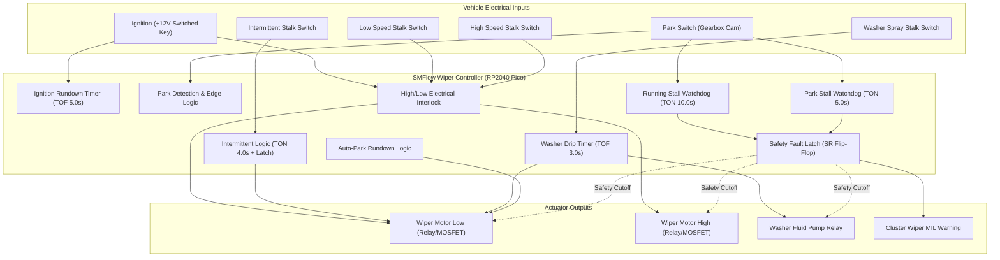
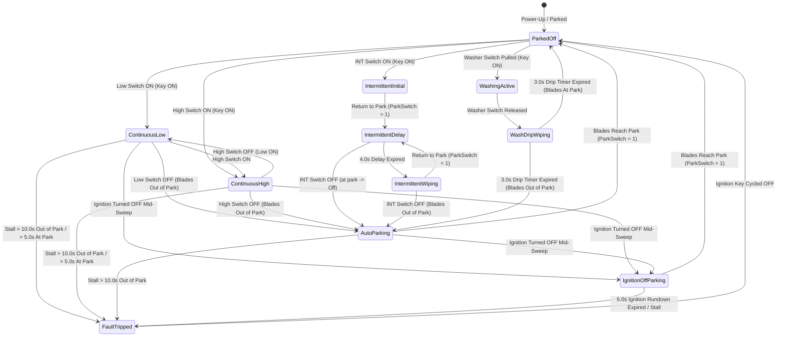

# Automotive Windshield Wiper Controller (WCM) — Technical Architecture

This document specifies the technical architecture, electrical interfaces, motor electromechanics, control algorithms, functional safety requirements, and fail-safe state machines for an SMFlow-based **Automotive Windshield Wiper Control Module (WCM)** designed for automotive restomods, kit cars, classic vehicle retrofits, and commercial vehicle body electronics.

---

## 1. Executive Summary & Engineering Context

Windshield wiper systems are among the most classic and elegant state machine applications in automotive engineering. While seemingly simple to the driver, real-world wiper systems present subtle physical and electrical challenges:

- **Mechanical Park Cam Synchronization**: A windshield wiper motor is coupled to a worm gear reduction gearbox with an internal mechanical cam switch. The controller cannot simply turn the motor off at an arbitrary moment; cutting power while blades are mid-windshield leaves them frozen in the driver's forward field of view. The motor must automatically continue running in low speed until the physical cam notch signals park rest.
- **Dual-Winding High/Low Interlock**: Automotive two-speed wiper motors utilize separate brushes on the commutator (typically a common negative ground brush, a low-speed brush at 180°, and a high-speed brush offset at ~120° to reduce back-EMF). Energizing both low-speed and high-speed brushes simultaneously causes severe circulating currents across the armature, burning out commutator segments within seconds. Strict hardware and software interlocking is required.
- **Ignition-Off Park Rundown**: Turning off the vehicle ignition while wipers are sweeping must not leave blades stranded vertically on the glass. A dedicated post-shutdown rundown circuit must maintain power until the sweep completes and the park switch closes.
- **Stall & Frozen Blade Protection**: Heavy snow, wiper blades frozen to the windshield in sub-zero temperatures, or mechanical linkage jamming draws locked-rotor stall current (typically 20 A to 35 A on a 12V automotive circuit). If sustained, this current melts plastic motor gearboxes, welds relay contacts, and risks under-dash electrical fires. Dual watchdog stall timers must isolate the motor within seconds if movement is blocked.
- **Fluid & Drip Management**: Operating the windshield washer must coordinate fluid spray with coordinated wiper strokes, followed by a post-wash drip wipe sequence after the washer stalk is released to eliminate residual droplet streaks.



---

## 2. Electrical System & Interface Specification

### 2.1 Hardware Schematic & Signal Conditioning

Automotive vehicle harnesses experience severe electrical transients (ISO 7637-2 pulses, load dumps up to 40V, and inductive flyback spikes from relays and motors). Inputs are attenuated and clamped to 3.3V logic levels for the Raspberry Pi Pico (`rp2040-pico`):

```
[ VEHICLE ELECTRICAL HARNESS ]                            [ SMFlow RP2040 Pico ]

+12V Switched Ignition ───[ 10k ]───┬──────────────────────────► GP14 (DI)
                                    │
                                 [ 3.3k ]
                                    │
                                   GND (via 3.3V Zener Clamp)

Park Switch (Motor Cam) ──[ 10k ]───┬──────────────────────────► GP15 (DI)
                                    │
                                 [ 3.3k ]
                                    │
                                   GND (Pull-down: True = At Park)

Wiper Low Stalk Switch ───[ 10k ]───┬──────────────────────────► GP16 (DI)
                                    │
                                 [ 3.3k ]
                                    │
                                   GND

Wiper High Stalk Switch ──[ 10k ]───┬──────────────────────────► GP17 (DI)
                                    │
                                 [ 3.3k ]
                                    │
                                   GND

Intermittent Switch ──────[ 10k ]───┬──────────────────────────► GP18 (DI)
                                    │
                                 [ 3.3k ]
                                    │
                                   GND

Washer Stalk Switch ──────[ 10k ]───┬──────────────────────────► GP19 (DI)
                                    │
                                 [ 3.3k ]
                                    │
                                   GND
```

### 2.2 Actuator Drivers & Output Relays

```
[ SMFlow RP2040 Pico ]                                  [ VEHICLE POWER DISTRIBUTION ]

GP20 (WiperMotorLow) ──[ 1k ]──► [ Gate N-MOSFET ] ──► Low-Speed 40A Relay ──► +12V Wiper Low Brush
                                    │ (1N4007 Snubber Diode across coil)

GP21 (WiperMotorHigh) ─[ 1k ]──► [ Gate N-MOSFET ] ──► High-Speed 40A Relay ─► +12V Wiper High Brush
                                    │ (1N4007 Snubber Diode across coil)

GP22 (WasherPump) ─────[ 1k ]──► [ Gate N-MOSFET ] ──► Washer Pump 20A Relay ─► +12V Washer Pump

GP26 (FaultIndicator) ─[ 1k ]──► [ Low-Side Driver ] ─────────────────────────► Instrument Cluster MIL
```

---

## 3. State Machine & Operating States

The wiper controller operates across ten distinct functional states:



### 3.1 State Definitions

| State | Outputs Active | Transition Conditions | Description |
| :--- | :---: | :--- | :--- |
| **ParkedOff** | None | Stalk switch turned ON | Standby resting state. Quiescent current < 100 µA. |
| **ContinuousLow** | `WiperMotorLow` | High switch, OFF switch, Key OFF, Stall | Motor drives low-speed winding (~45 wipes/min). |
| **ContinuousHigh** | `WiperMotorHigh` | High switch released, Key OFF, Stall | Motor drives high-speed winding (~65 wipes/min). Low is interlocked OFF. |
| **IntermittentInitial** | `WiperMotorLow` | Return to park (`ParkSwitch` 0→1) | Immediate single wipe upon selecting INT position. |
| **IntermittentDelay** | None | 4.0s pause expired, Switch turned OFF | Blades stationary at park during intermittent pause. |
| **IntermittentWiping** | `WiperMotorLow` | Return to park (`ParkSwitch` 0→1) | Single periodic wipe cycle triggered by timer expiration. |
| **WashingActive** | `WasherPump`, `WiperMotorLow` | Washer stalk released | Fluid pump spraying and wipers sweeping wet glass. |
| **WashDripWiping** | `WiperMotorLow` | 3.0s TOF timer expired | Post-spray clearing wipe cycles to remove fluid and runoff drips. |
| **AutoParking** | `WiperMotorLow` | Park switch closes (`ParkSwitch` = 1) | Motor runs in Low until blades reach mechanical rest position. |
| **IgnitionOffParking**| `WiperMotorLow` | Park switch closes (`ParkSwitch` = 1) | 5.0s ignition rundown power completes sweep after key-off. |
| **FaultTripped** | `FaultIndicator` | Ignition cycled OFF | Safety shutdown: motor outputs de-energized; warning lamp ON. |

---

## 4. Subsystem Design & SMFlow Logic Implementation

### 4.1 Park Detection & Auto-Park Rundown
The mechanical park switch inside the wiper motor gearbox is closed (`ParkSwitch == true`) only when the wiper arms are resting in the cowl at the bottom of the windshield. As soon as the motor rotates, the cam opens (`ParkSwitch == false`).

In SMFlow:
- `not_parked` (`not` node) inverts `ParkSwitch`.
- `timer_ign_rundown` (`tof` node, 5000 ms) provides a 5.0-second power retention window after ignition is turned off.
- `gate_park_rundown` (`and` node) asserts `not_parked AND timer_ign_rundown.Q`.
- Whenever the driver switches off the wipers mid-sweep, or turns off the ignition key mid-sweep, `gate_park_rundown` feeds into `gate_low_combined`, forcing `WiperMotorLow` to remain active until the blades physically reach park (`ParkSwitch == true`).
- Once `ParkSwitch` becomes true, `not_parked` drops false, instantly turning off `WiperMotorLow`.

### 4.2 Intermittent Wiping & Immediate First-Wipe Logic
Driver ergonomics require that selecting Intermittent mode immediately performs one wipe without delay, and then enters the periodic interval:
- `edge_int_start` (`rising-edge` node) fires on the transition into Intermittent mode.
- `gate_int_timer_en` (`and` node) enables `timer_int_delay` (`ton` node, 4000 ms) only while the wipers are resting at park (`ParkSwitch == true`) in Intermittent mode.
- When `timer_int_delay` reaches 4000 ms, `edge_int_timer` (`rising-edge` node) pulses.
- `gate_int_wipe_trig` (`or` node) combines `edge_int_start.Q` and `edge_int_timer.Q` to set `latch_int_wipe` (`set-reset` node).
- `edge_park_rise` (`rising-edge` node on `ParkSwitch`) resets `latch_int_wipe` when the wipe cycle returns to park.
- While the wiper is in motion (`ParkSwitch == false`), `gate_int_timer_en` is false, resetting the delay timer back to 0 ms. When the blades return to park, the 4000 ms pause timer starts anew.

### 4.3 Washer Pump & Post-Wash Drip Wipes
- Pulling the washer stalk energizes `out_washer_pump` (`WasherPump`) immediately, provided ignition is ON and no fault is latched.
- `timer_wash_drip` (`tof` node, 3000 ms) extends the low-speed wiper command for 3.0 seconds after the washer stalk is released.
- During this 3-second post-wash period, the wipers perform 2–3 full sweeps to clear cleaning fluid and overspray from the glass.
- When the 3.0-second timer expires, `gate_park_rundown` completes the final sweep and halts the blades at park.

### 4.4 Electrical Interlocking Between Low and High
- High-speed request `gate_high_req` is inverted by `not_high`.
- `not_high` gates both `gate_low_cmd` and `gate_low_interlocked`.
- Under no circumstance can `WiperMotorLow` and `WiperMotorHigh` be energized simultaneously, preventing armature short circuits and relay back-feeding.
- If the driver switches directly from High to OFF, `WiperMotorHigh` drops immediately, and `gate_park_rundown` takes over via `WiperMotorLow` to bring the blades smoothly to park.

### 4.5 Dual Watchdog Stall Protection (Fault Timeout)
Two independent stall failure modes are monitored:
1. **Running Stall (`timer_run_stall`, TON 10000 ms)**:
   - Detects motor commanded active while out of park (`gate_cmd_any AND not_parked`).
   - During normal operation, the blades cross the park switch once every 1.0 to 1.4 seconds, which resets the TON timer back to 0.
   - If the linkage jams or blades freeze to glass mid-windshield, the timer reaches 10.0 seconds, tripping `latch_fault`.
2. **Park Stall (`timer_park_stall`, TON 5000 ms)**:
   - Detects motor commanded active while stuck in park (`gate_cmd_any AND in_park`).
   - If blades are frozen to the glass by ice at the park position, the motor cannot leave park.
   - After 5.0 seconds of continuous locked-rotor current at park, `timer_park_stall` reaches 5.0 seconds, tripping `latch_fault`.
3. **Fault Latch Action**:
   - `latch_fault` sets `out_fault` (`FaultIndicator`) ON.
   - `not_fault` inverts the fault latch, cutting off `WiperMotorLow`, `WiperMotorHigh`, and `WasherPump`.
   - The latch can only be reset by cycling the vehicle ignition switch OFF (`not_ign.out` connects to `latch_fault.R`).

---

## 5. Timing, Edge Detection & Determinism

### 5.1 Deterministic Scan Execution
- Task Period: **10 ms** (100 Hz scan frequency).
- In a 10 ms cycle, input sampling, logic arbitration, edge detection, and output driving execute in under 40 microseconds on the RP2040 Cortex-M0+ core at 133 MHz.
- Jitter is less than 5 microseconds.
- Edge detection nodes (`rising-edge`) sample state across consecutive scans, guaranteeing single-scan triggers regardless of switch contact bounce.

### 5.2 Elimination of Dependency Cycles
The SMFlow graph is strictly structured as a Directed Acyclic Graph (DAG):
- Stall monitoring (`gate_cmd_any`) samples the pre-fault command signals rather than the post-fault motor outputs.
- Fault gating (`not_fault`) occurs strictly at the terminal output layer (`gate_motor_low`, `gate_motor_high`, `gate_washer_pump`).
- This design satisfies SMFlow's strict topological scheduling invariants, ensuring deterministic forward evaluation with zero cyclic dependencies.

---

## 6. Traceability Matrix

| Requirement | System Component | SMFlow Nodes | Test Assertion |
| :--- | :--- | :--- | :--- |
| **Park switch detection** | Gearbox cam switch | `in_park`, `not_parked`, `edge_park_rise` | `"turning wiper switch off mid-sweep continues running until park switch detected"` |
| **Continuous Low mode** | Low speed stalk position | `in_low`, `gate_low_req`, `gate_low_cmd`, `out_motor_low` | `"continuous low mode energizes low-speed motor winding"` |
| **Continuous High mode** | High speed stalk position | `in_high`, `gate_high_req`, `out_motor_high` | `"continuous high mode energizes high-speed motor winding and disables low"` |
| **High/Low interlock** | Electrical interlock | `not_high`, `gate_low_interlocked` | `"high speed command overrides low speed switch with electrical interlock"` |
| **Intermittent initial wipe** | Mode entry edge trigger | `edge_int_start`, `gate_int_wipe_trig`, `latch_int_wipe` | `"intermittent mode triggers immediate initial wipe cycle"` |
| **Intermittent pause delay** | 4.0s dwell timer | `gate_int_timer_en`, `timer_int_delay`, `edge_int_timer` | `"intermittent pause holds motor off until delay expires"` |
| **Intermittent repeat wipe** | Periodic cycle trigger | `edge_int_timer`, `latch_int_wipe` | `"intermittent mode triggers next wipe cycle after 4s pause expires"` |
| **Washer fluid spray** | Stalk momentary pull | `in_washer`, `gate_washer_req`, `out_washer_pump` | `"washer stalk pull energizes washer pump and low-speed wipers"` |
| **Post-wash drip wipe** | 3.0s off-delay drip timer | `timer_wash_drip`, `gate_wash_wipe` | `"releasing washer stops pump immediately while maintaining 3s post-wash drip wipe"` |
| **Post-wash auto-park** | End of drip wipe sequence | `timer_wash_drip`, `gate_park_rundown` | `"post-wash drip wipe completes and parks after 3s timer expires"` |
| **Ignition-off park rundown** | 5.0s post-key power hold | `timer_ign_rundown`, `gate_park_rundown` | `"ignition key off mid-sweep completes automatic park rundown"` |
| **Ignition-off stationary** | Key-off parked safety | `in_ign`, `timer_ign_rundown`, `not_parked` | `"key off while already parked keeps all outputs de-energized"` |
| **Running stall timeout** | 10.0s out-of-park watchdog | `gate_stall_running`, `timer_run_stall`, `latch_fault` | `"wipers jammed out of park for 10s trips running stall watchdog and shuts down"` |
| **Park stall timeout** | 5.0s frozen-at-park watchdog | `gate_stall_at_park`, `timer_park_stall`, `latch_fault` | `"wipers frozen at park for 5s trips park stall watchdog and shuts down"` |
| **Fault reset** | Key cycle reset | `not_ign`, `latch_fault:R` | `"cycling ignition key clears latched stall fault"` |
