# Lab 0 — How SMFlow works

**Time:** 25 minutes, reading · **Hardware:** none · **You build nothing in this lab**

---

This is the tour. No project, no canvas, no wiring — just the model, so that when you start
building in Lab 1 the vocabulary is already yours.

If you prefer to learn by doing, skip to [Lab 1](../lab-01-first-flow/) and come back when a word
stops making sense. Nothing here is a prerequisite you can't pick up later. But most people find
that twenty-five minutes spent here saves an hour of "wait, why did it do that" over the next three
labs.

---

## Where you're coming from

This series is written for two readers, and you are probably one of them.

**If you come from PLCs** — ladder, structured text, function blocks — most of your instincts
transfer directly. You already think in scans, in I/O images, in deterministic ordering. The
adjustments you'll need to make are small but real, and I'll flag each one.

**If you come from embedded C or Arduino** — `setup()`, `loop()`, interrupt handlers, register
pokes — you already understand the machine underneath. What's unfamiliar is the discipline:
SMFlow takes away some freedom you're used to having, deliberately, and gives back determinism and
a program you can reason about.

Here's the whole translation table up front. Don't try to absorb it yet; it's here to come back to.

| SMFlow | PLC equivalent | Arduino / embedded C equivalent |
|---|---|---|
| **Scan** | Scan cycle | One pass of `loop()` — but on a fixed period |
| **Task** | Program / POU with a cycle time | A timed slice of `loop()` you'd hand-roll with `millis()` |
| **Init task** | First-scan bit (`FirstScan`, `SM0.1`) | `setup()` |
| **Interrupt task** | Hardware interrupt OB | `attachInterrupt()` ISR |
| **Node** | Instruction / function block | An expression or statement |
| **Wire** | Rung connectivity / FBD link | Passing a value between expressions |
| **Shared variable** | Global tag / M-memory | A `static` or global variable |
| **Logical I/O point** | Symbolic tag (`%I0.0` ↔ `StartButton`) | A `#define PIN_START 14` you never write |
| **Hardware binding** | The I/O configuration table | Your pin assignments |
| **Target** | The CPU model you compile for | The board you select in the IDE |
| **Peripheral** | A configured device / IO-Link module | A driver library you'd add |
| **Build** | Download to PLC | Compile + flash |
| **Simulator** | PLCSIM / emulation | Running the sketch on your laptop |

---

## 1. SMFlow is a compiler

Start here, because everything else follows from it.

The graph you draw is **source code**. It is parsed, type-checked, lowered to an intermediate
representation, and translated into ordinary C++ — ahead of time, on your machine, before anything
is deployed. The C++ is then compiled by a normal native toolchain into a normal native binary.

```
Visual graph → Project model → Typed IR → Validation → Target lowering → C++ → native compiler → artifact
```

What runs on the controller is that binary. There is **no SMFlow on the controller**: no
interpreter, no scripting engine, no graph structure, no runtime library of ours. No .NET, no
Node.js, no Python, no JVM. The controller never learns that a graph existed.

> **PLC readers:** this is closer to a compiled C target than to a PLC runtime executing bytecode.
> There is no firmware on the box that interprets your program — your program *is* the firmware.
>
> **Arduino readers:** think of SMFlow as a code generator that writes the sketch for you, except
> that the sketch is good enough to maintain by hand if you ever stopped using the tool.

Two consequences worth internalizing now:

- **The editor is not the runtime.** It's an authoring tool. The CLI builds projects; a build
  server never installs the editor.
- **The generated code is the deliverable.** It goes in your repo, through your review process,
  and in front of engineers who don't use SMFlow. Lab 1 is mostly about reading it.

---

## 2. The scan

A SMFlow program doesn't run continuously. It runs in **scans**.

One scan is: read all inputs → evaluate the logic → write all outputs. Then wait for the next
period and do it again.

```
┌────────────────────────┐
│  Snapshot inputs       │   once per tick
├────────────────────────┤
│  Run each due task     │   in priority order, to completion
├────────────────────────┤
│  Commit outputs        │   once per tick
├────────────────────────┤
│  Diagnostics           │
└───────────┬────────────┘
            └──> wait for next tick
```

<!-- shot 0.02 -->
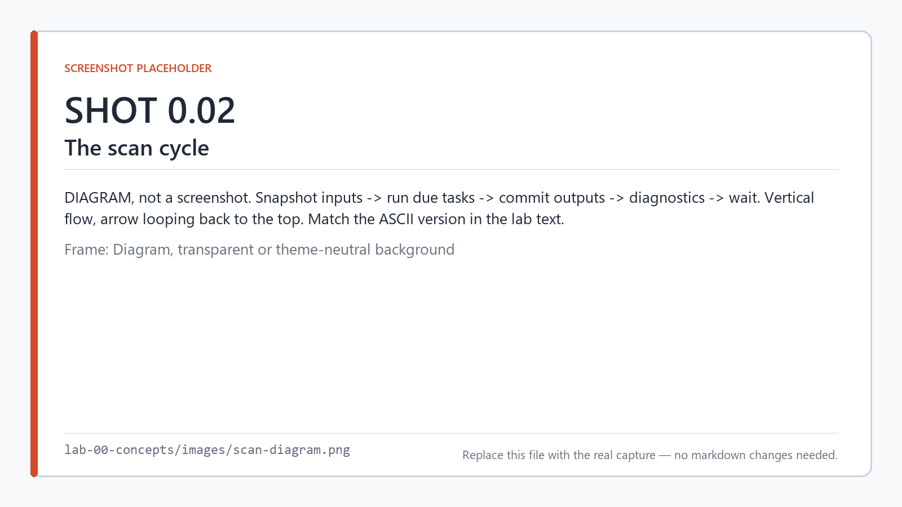

*One tick: snapshot inputs, run every task that is due, commit outputs.*

> **PLC readers:** this is the scan you already know, including the I/O image. Your intuition is
> correct. Keep it.
>
> **Arduino readers:** this is `loop()`, with two differences that matter. First, it runs on a
> **fixed period**, not as fast as it can — your logic is re-evaluated every 10 ms (or whatever you
> declare), not 400,000 times a second. Second, **I/O is snapshotted**, which is the part that will
> surprise you. Keep reading.

### Snapshot and commit

This is the one concept most worth slowing down on, because it's where the Arduino mental model
breaks.

Inputs are read **once**, at the top of the scan, into a struct. Your logic reads that struct, not
the pins. Outputs are written to the struct, and the struct is pushed to the pins **once**, at the
bottom.

So if you read the same input twice in one scan, you get the same answer both times — even if the
physical pin changed in between. And if you write an output early in the scan and again later, only
the last value ever reaches the pin.

<!-- shot 0.03 -->
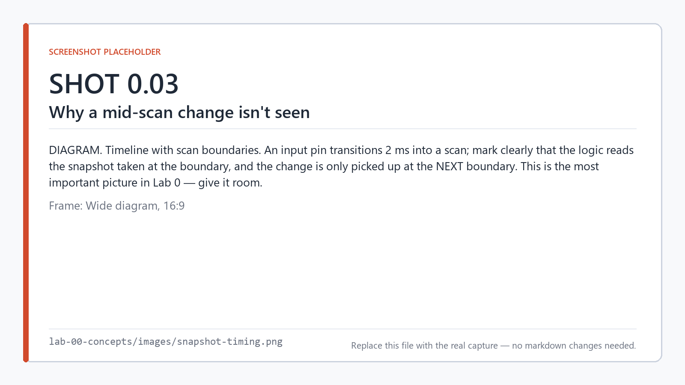

*An input that changes mid-scan is not seen until the next snapshot.*

```cpp
while (stopRequested == 0)
{
    smflow::ReadInputs(io);     // ← all inputs, once

    if (elapsedMs % 10ull == 0) { smflow::MainTask(io); }

    smflow::WriteOutputs(io);   // ← all outputs, once

    elapsedMs += kTickMs;
    Advance(deadline, kTickMs);
    SleepUntil(deadline);
}
```

*(That's real generated code, not pseudocode. You'll build the project that produces it in Lab 1.)*

Why do it this way? Because it makes one scan a **pure function** of its inputs and its retained
state. Same inputs plus same state in, same outputs out — always, reproducibly, on any target. That
is what makes the program testable, what makes the simulator trustworthy, and what makes two tasks
at different rates unable to disagree about what the inputs were.

> **Arduino readers:** you lose the ability to poll a pin mid-loop and react within microseconds.
> If you genuinely need that, it's an *interrupt task* (§3), not a faster scan. Resist the urge to
> reach for one before you've measured.

### Scan period and responsiveness

Your worst-case response to an input change is roughly one scan period, plus the time the scan
takes. A 10 ms task responds within about 10–20 ms. If that isn't fast enough, shorten the period
or use an interrupt task — but know which you need and why.

---

## 3. Tasks

A **task** is a unit of execution with a rule for when it runs. Every node belongs to exactly one
task. There's no loose logic.

A task declares:

| Field | Meaning |
|---|---|
| **Name** | Becomes the generated function, `<Name>Task` |
| **Period** | How often it runs, in ms. Explicit — never silently defaulted |
| **Priority** | Order among tasks due on the same tick; lower runs first |
| **Budget** | Optional. The runtime counts scans that exceed it |

<!-- shot 0.04 -->
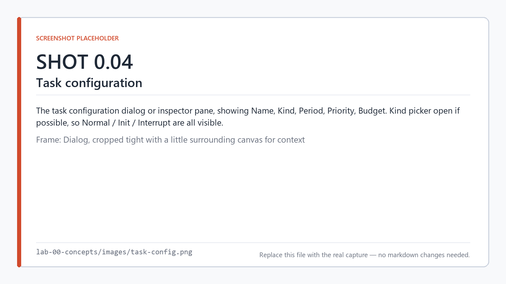

*A task declares its kind, its period, its priority, and optionally a budget.*

### Three kinds of task

**Normal** — repeats on a fixed period, forever. This is the default and it's what you'll use for
essentially everything.

**Init** — runs **once**, before the first normal scan. For setup: seeding shared variables,
putting a peripheral into a mode, latching an output to a safe level. A project may have at most
one, because "before everything else" admits no ordering between two of them.

> This is `setup()`. It is also your first-scan bit. If you've been writing `IF FirstScan THEN`,
> that logic goes in an init task instead.

**Interrupt** — runs on an edge (rising, falling, or change) on a digital input, **outside the
scan**. For what a scan is too slow or too coarse to catch: a pulse shorter than the period, or a
stop that mustn't wait for the next tick. It compiles to a real interrupt handler on the target, so
what it's allowed to contain is restricted, and the compiler enforces that.

Interrupt tasks are deliberately not covered in this series. They're a sharp tool and the
fundamentals don't need them.

### Many tasks, one tick

When you declare several tasks, the generated scheduler runs at a base **tick** equal to the
**greatest common divisor of every task period**.

Declare a 10 ms task and a 25 ms task, and the tick is 5 ms:

```cpp
constexpr std::uint64_t kTickMs = 5;

while (stopRequested == 0)
{
    smflow::ReadInputs(io);

    if (elapsedMs % 10ull == 0) { /* FastTask */ }
    if (elapsedMs % 25ull == 0) { /* SlowTask */ }

    smflow::WriteOutputs(io);
    ...
}
```

Every task then fires exactly on its own period, with no rounding. A scheduler running at any other
rate would drift against at least one of them.

<!-- shot 0.05 -->
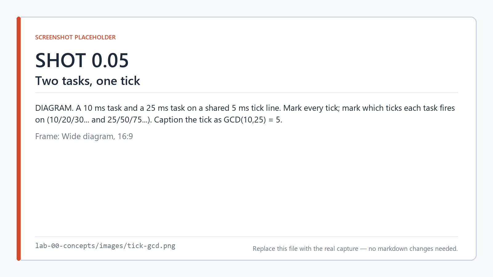

*A 10 ms and a 25 ms task share a 5 ms tick — the GCD of their periods.*

Scheduling is **cooperative and single-threaded**. Tasks run to completion; nothing preempts
anything. Priority orders tasks that come due together, and ties break on declaration order — so
the schedule is total and deterministic, not merely "usually the same."

> **PLC readers:** no preemption. A long scan in a low-priority task *will* delay a high-priority
> one that comes due during it. The diagnostics count that (§10) but nothing prevents it.

---

## 4. Nodes, ports, and wires

A **node** is one operation: read an input, invert a boolean, compare two numbers, start a timer,
write a variable, push text to a display.

A node has:

- **Input ports** — values it consumes
- **Output ports** — values it produces
- **Properties** — configuration, set in the inspector, fixed at compile time

The difference between a port and a property matters. A **port** is dataflow: a value that can
change every scan, arriving over a wire. A **property** is configuration: a timer's preset, a
comparison's operator, a variable's name. Properties are baked into the generated code; ports
become variables in it.

> **PLC readers:** a node is an instruction or a function block. Ports are the pins on the block;
> properties are what you'd configure in the block's dialog.

<!-- shot 0.06 -->
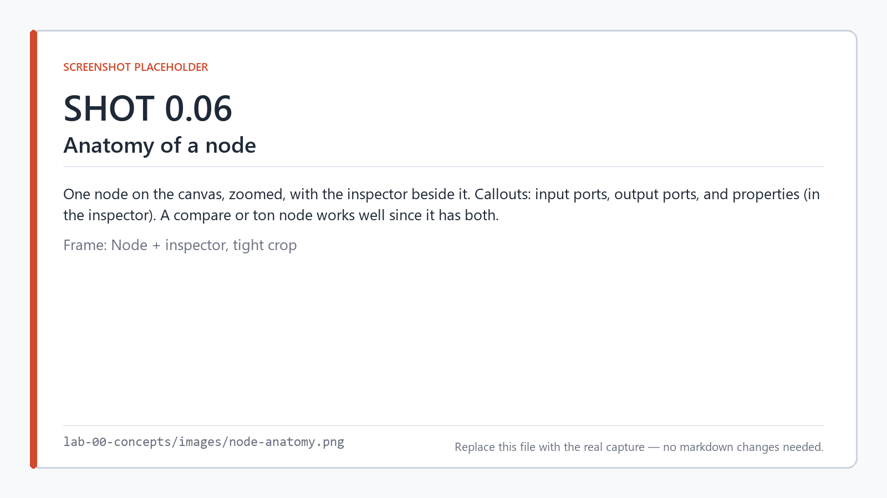

*Ports carry values; properties are configuration, fixed at compile time.*

A **wire** carries one value from one output port to one input port. Rules:

- **An input port accepts at most one wire.** Two sources for one input has no meaning, so the
  editor refuses it.
- **An output port can feed many inputs.** Fan-out is fine.
- **A wire may not cross tasks**. Cross-task data goes through a shared variable (§5).
- **No cycles.** A combinational loop is an error, not an oscillator.

### Node categories

The catalog ships roughly 70 node types in five families:

| Category | What's in it |
|---|---|
| **I/O** | `digital-input`, `digital-output`, `analog-input`, `analog-output`, `pwm-output`, `tone-output`, `serial-tx`, `serial-rx` |
| **Logic** | `and`, `or`, `not`, `compare`, `select`, `to-text`, payload pack/unpack |
| **Timing** | `ton` (on-delay), `tof` (off-delay), `rising-edge`, `falling-edge`, `blink` |
| **State** | `counter`, `set-reset`, `toggle`, variable read/write/update, persistence control |
| **Peripherals** | Display, sensor, radio, CAN, and storage device nodes — the largest group by far |

Run `smflow` with the MCP server, or browse the [node reference](../../docs/nodes/), for the
authoritative list on your install. Don't assume a node exists because it existed in a video.

### Types, and the absence of coercion

Values are typed: `bool`, `int32`, `uint32`, `float32`, `float64`, `duration`, `bytes`.

**Assignment is exact-match only.** There are no implicit conversions and no numeric promotion. You
cannot wire a `float32` into an `int32` input and have the compiler quietly truncate it. If you want
a conversion, you place a conversion node, and it's visible in the graph where anyone reviewing it
can see it.

`duration` is deliberately a separate type from the integers, so that a counter can't be wired into
a timer preset. That's a bug class removed by the type system rather than by code review.

<!-- shot 0.07 -->
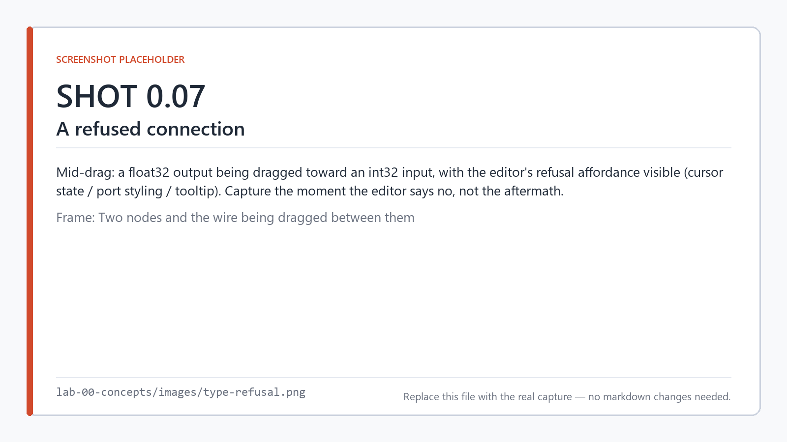

*The editor refuses a connection between mismatched types rather than coercing.*

> This is stricter than C and stricter than most PLC languages. It's also the single biggest source
> of "why won't it let me connect this" in your first hour. The answer is always: it's telling you
> the two things aren't the same kind of thing.

---

## 5. Variables

Wires carry values *within* a task, within a scan. **Shared variables** carry values across tasks
and across scans.

A variable is declared in the project with a name, a type, an initial value, and a persistence
setting:

```json
{ "name": "PressCount", "type": "int32", "initial": "0", "persistence": "retained" }
```

You reach it with nodes, not wires:

| Node | What it does |
|---|---|
| `variable-read` | Produces the current value |
| `variable-write` | Stores a value |
| `variable-update` | Read-modify-write as **one** atomic operation (add, subtract, etc.) |

<!-- shot 0.08 -->
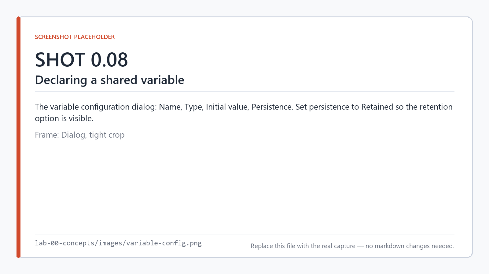

*Declaring a shared variable: name, type, initial value, and persistence.*

Why nodes instead of a wire across tasks? Because a wire between two tasks running at different
periods would have to carry a timing rule the picture doesn't show. A node makes the access visible
exactly where it happens.

### Atomicity

Every access to a shared variable is atomic, unconditionally — one node is one access, taken in
place. In the generated code this is a critical section:

```cpp
bool LoadShared_Enable()
{
    EnterCritical();
    const bool value = g_shared.Enable;
    ExitCritical();

    return value;
}
```

But atomicity is **per access**. A read, then some arithmetic, then a write is *two* accesses with a
gap between them, and another task can write in that gap. `variable-update` exists precisely to do
the whole read-modify-write as one operation, and the validator warns (`SMF0025`) when your graph
has the torn shape.

> **Arduino readers:** this is the `volatile` / `noInterrupts()` discipline, except the compiler
> applies it for you and warns when your logic needs it and doesn't have it.

### Persistence

`persistence: "retained"` means the value survives a power cycle. Where it's stored depends on the
target, and the project says so explicitly:

```json
"persistence": {
  "retained": {
    "esp32-s3":      "nvs0",
    "rp2040-pico":   "flash0",
    "atmega328-uno": "eeprom0",
    "linux-x64":     "file0"
  }
}
```

Persistence is explicit, never automatic, and saving is something you trigger with a node
(`persist-save`). That's because flash and EEPROM have finite write endurance, and a tool that
silently wrote every scan would destroy the part in a weekend. Lab 11 covers this properly.

> **PLC readers:** retained variables, with the write cost made visible instead of hidden.

---

## 6. I/O: logical names, not pins

**The graph never names a pin.** It names a logical resource:

```
Graph:      EmergencyStop              ← what the program means

Binding:    opta       → I2            ← how each board realizes it
            rp2040-pico → gpio17
            simulator   → virtual.EmergencyStop
```

The binding lives beside the graph, not inside it. Nothing in the graph changes when the board
changes — only which row of the binding table gets read.

A logical resource carries a name, a direction, a type, and a per-target binding map:

```
HardwareResource
├── LogicalName   "EmergencyStop"
├── Direction     Input | Output
├── DataType      bool
└── Bindings      { "opta": "I2", "rp2040-pico": "gpio17" }
```

<!-- shot 0.09 -->
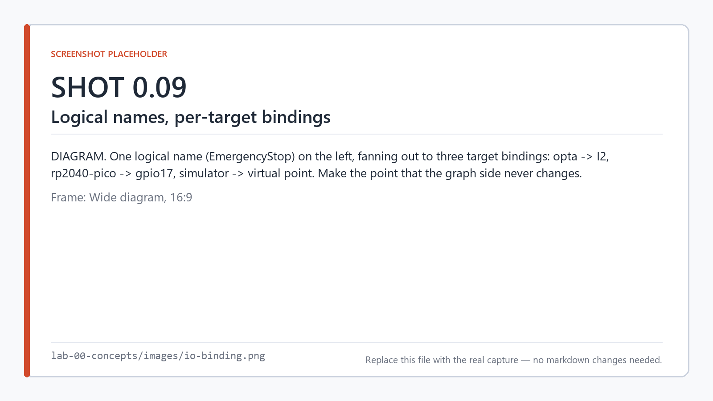

*One logical name, bound to a different physical resource on each target.*

It's a map rather than a single string because the same project genuinely does get built for several
boards. A project that could hold only one binding would force you to keep a copy per target — and
copies drift, and then the logical name stops meaning anything.

If a target isn't in the map, SMFlow allocates a pin from that target's profile and tells you:

```
  in  StartButton -> gpio0  (allocated)
  out Motor       -> gpio1  (allocated)
```

Fine for a bench test; you'll pin it down explicitly before it matters. Lab 8 does exactly that.

Logical names become C++ identifiers, so they must be valid identifiers, unique, and not C++
reserved words. The validator enforces it.

---

## 7. Targets

A **target** is a board plus a toolchain plus a hardware profile. `smflow targets` lists what your
install supports:

| Family | Targets |
|---|---|
| Host | `portable`, `simulator` |
| Linux | `linux-x64`, `linux-arm64` |
| Arduino / mbed | `opta`, `rp2040-pico`, `rp2040-nano-connect` |
| ESP32 | `esp32-s3`, `heltec-lora32-v3` |
| AVR | `atmega328-uno`, `atmega328-nano`, `atmega2560-mega` |

<!-- shot 0.10 -->
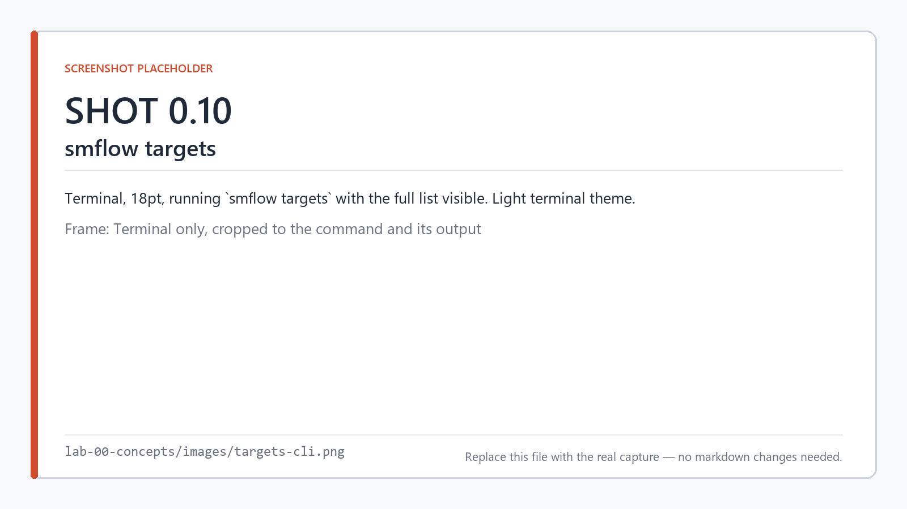

*`smflow targets` lists every board this installation can build for.*

A target's **profile** is a declaration of what that board actually has: its pins and what each can
do, its analog resolution, its communication buses, its storage. The profile is data, not code. The
compiler reads it to lower your logical I/O onto real hardware and to refuse bindings the board
can't honor.

The important architectural point: **no board is hard-coded into the compiler.** Target specifics
live in target modules. That's what makes Lab 9 — the same graph on three boards — a five-minute
exercise instead of a port.

`simulator` is a target like any other. It compiles your flow to a host binary and runs it against a
virtual I/O table and a simulated clock. It is **not** an interpreter and **not** a second
implementation of your logic — which is exactly why its results are worth trusting, and also why
you need a C++ compiler installed even for labs with no hardware.

---

## 8. Peripherals

A peripheral is a part on a bus: a display, a sensor, a radio, a CAN controller, a storage chip.

You declare the **device**, not the bus traffic:

```json
"peripherals": [
  { "name": "Oled", "type": "solomon:ssd1306" }
]
```

Then you use nodes bound to that device — `ssd1306-text` writes a line to it. You never compose an
I²C transaction, never pick a register address, never write a byte sequence. The driver knows the

<!-- shot 0.11 -->
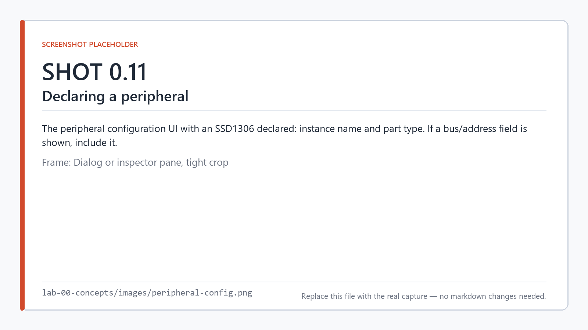

*A peripheral is declared as a named instance of a part.*
part; you know what you want displayed.

Three rules worth knowing before Lab 12:

**A driver either drives the part or refuses to build.** There's no partially-working peripheral and
no "mostly supported" device. If the driver can't honor what you asked for on the board you chose,
you get a build error, not a runtime surprise.

**Device operations are asynchronous and never block the scan.** An I²C display write takes
milliseconds — far too long to stall a 10 ms task. So device nodes expose a `trigger` input and a
`busy` output: you start the operation, and it completes over subsequent scans. The scan stays
bounded. `docs/timing.md` publishes the per-operation budget for each driver.

**Buses live in the hardware profile.** Which I²C bus exists, on which pins, at what speed, is a
property of the target, not of your graph.

> **Arduino readers:** this replaces `#include <Adafruit_SSD1306.h>` and the setup incantation that
> goes with it. You lose the ability to do something the driver didn't anticipate. You gain a
> peripheral that can't blow your scan budget.

---

## 9. The toolchain

### The editor

<!-- shot 0.01 -->
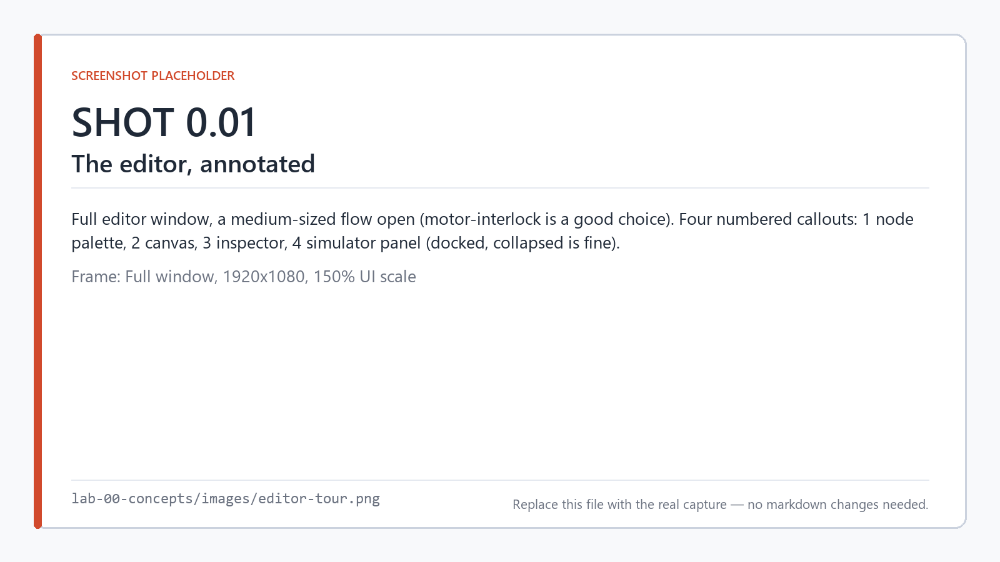

*The editor: palette, canvas, inspector, and the docked simulator panel.*

Canvas, node palette, inspector for the selected node's properties, and a docked simulator panel.
**F5** simulates, **F6** builds. The canvas is where you author; it holds layout — positions, group
boxes, colors — and none of that reaches the compiler. Where you put a node has no effect on what
the program does.

### The CLI

`smflow` is the source of truth for builds. The editor never compiles anything itself.

| Command | What it does |
|---|---|
| `smflow validate <project>` | Type-check and rule-check. Nothing proceeds until this passes |
| `smflow build <project> --target <id>` | Generate C++ and compile it. `--emit-only` stops after generating |
| `smflow simulate <project>` | Build for host and run with virtual I/O |
| `smflow test <project>` | Run `.smtest` graph-level tests |
| `smflow deploy <project> --port <addr>` | Flash it |
| `smflow analyze <project>` | Build analysis without a full build |
| `smflow targets` / `smflow devices` | What you can build for; what's plugged in |
| `smflow new` / `add-node` / `connect` | Author from a script |
| `smflow mcp` | Expose the project to an AI assistant |

### The build report

Every build writes one. It's the fastest way to see what your program actually costs:

```
  Task        Period      Nodes   Ops   State Size
  Fast        10 ms       2       2     0 B
  Slow        25 ms       2       2     0 B
  Total: 2 task(s), 4 node(s), 4 operation(s), 0 B state

  RAM (Application State)  3 bytes        [statically calculated]
  Stack Frame Depth        bounded (flat scan loop)
```

Note *bounded*. The generated code is non-recursive with flat task call frames and no dynamic
allocation, so stack depth is a number you can know rather than a thing you hope about.

<!-- shot 0.12 -->
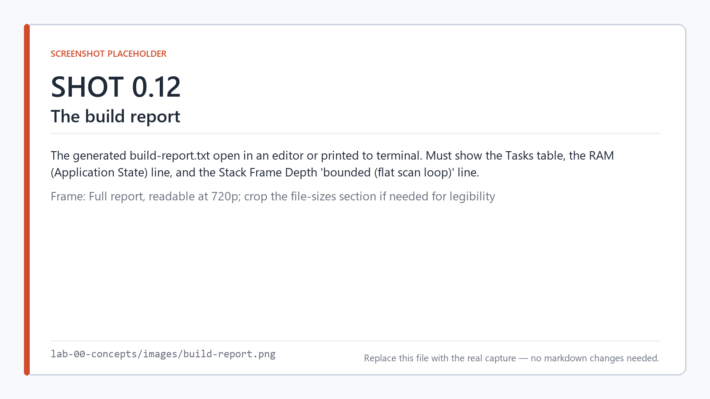

*Every build writes a report: task costs, memory, and bounded stack depth.*

### Validation runs first, always

An invalid graph **cannot** produce code. Not partial code, not best-effort code with a warning.
Diagnostics have stable codes (`SMF0005`, `SMF0015`, …) that you can grep in CI, and they name the
node so the editor can highlight it.

You'll meet these early:

| Code | Means |
|---|---|
| `SMF0005` | A required input isn't connected |
| `SMF0006` | An input already has a connection |
| `SMF0015` | A wire crosses tasks — use a shared variable |
| `SMF0016` | Two nodes drive the same output |
| `SMF0025` | Torn read-modify-write on a shared variable |

<!-- shot 0.13 -->
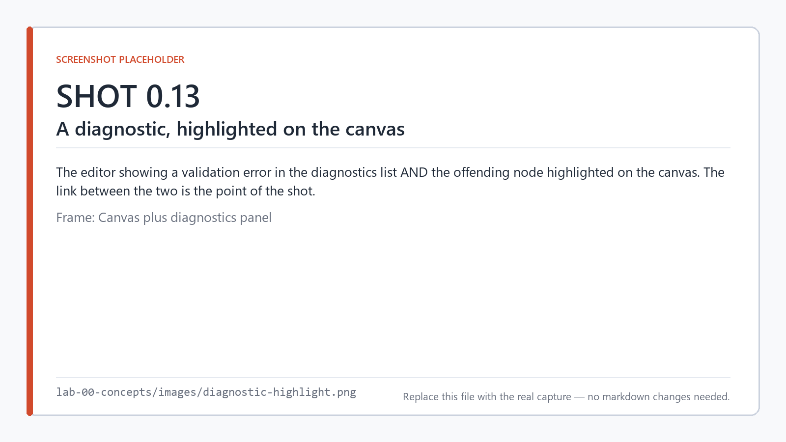

*A diagnostic names the node, and the editor highlights it on the canvas.*

---

## 10. What SMFlow guarantees — and what it doesn't

Be precise about this, because precision here is what separates a tool you can put on a machine
from a tool you can put in a demo.

**Guaranteed: deterministic logical execution.** Execution order within a task is computed at
compile time by topological sort, made total by a deterministic tiebreak. The generated code is a
fixed, linear statement sequence. Same inputs and same state produce the same outputs, every time,
on every target. Build the same project twice and you get **byte-identical** C++ — no timestamps,
no generated IDs, no hash ordering leaking in.

**Measured: execution time.** The generated runtime keeps a `TaskDiagnostics` record per task:
period, budget, execution count, last scan duration, budget overruns, deadline misses. These are
observations taken with the target's clock, after the fact.

**Not claimed: hard real-time.** SMFlow does not promise a deadline will be met. It runs as an
ordinary process or a cooperative superloop, not under an RTOS with admission control. If your
application needs a provable worst-case response, SMFlow doesn't provide it, and you should know
that now rather than at commissioning.

The rule this implies: **design for the order, measure the time, and don't confuse the two.** See
[`docs/timing.md`](https://github.com/state-machine-flow/SMFlow/blob/main/docs/timing.md) for the
full treatment, including per-driver scan budgets.

> In simulation, overrun and deadline-miss counters are structurally zero, because a simulated scan
> takes no simulated time. Timing numbers only mean something on hardware.

---

## 11. The whole picture

```
  ┌──────────────┐
  │  .smflow     │   your graph, tasks, variables, bindings, peripherals
  └──────┬───────┘   (layout lives here too, and never goes further)
         │
  ┌──────▼───────┐
  │  Validation  │   types, connections, task rules, names
  └──────┬───────┘   ✗ → diagnostics, and nothing is generated
         │ ✓
  ┌──────▼───────┐
  │  Typed IR    │   ordered operations, still hardware-agnostic
  └──────┬───────┘
         │
  ┌──────▼───────┐
  │  Lowering    │   target profile decides what a pin, a bus, a store is
  └──────┬───────┘
         │
  ┌──────▼───────┐
  │  C++17       │   application.cpp · hardware.cpp · main.cpp
  └──────┬───────┘   reviewable, deterministic, yours
         │
  ┌──────▼───────┐
  │  Native      │   the artifact that ships
  │  binary      │
  └──────────────┘
```

Three separate representations with three different jobs. The `.smflow` file is not the IR, and
neither is the C++. Keeping them apart is what lets one graph build for a Pico and an Opta without
either board leaking into the compiler.

<!-- shot 0.14 -->
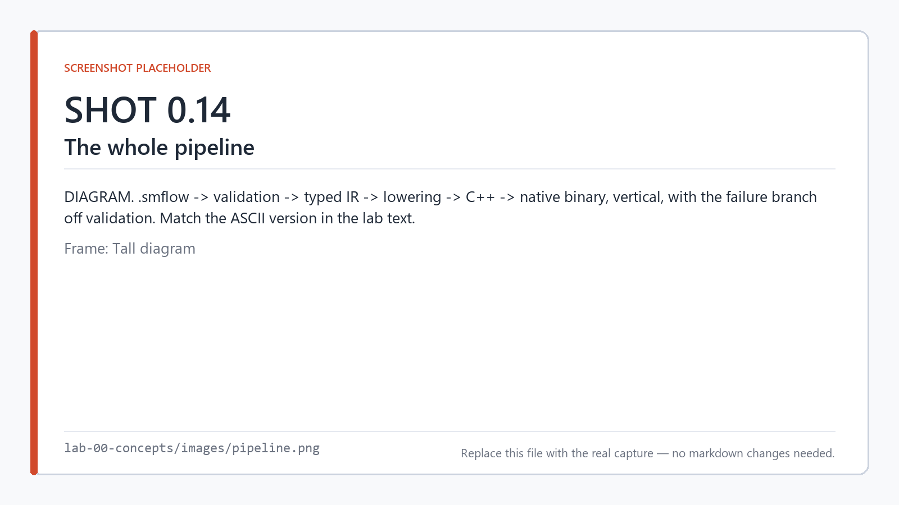

*The pipeline: project file to native binary, with validation as the gate.*

---

## Check yourself

You're ready for Lab 1 if you can answer these without scrolling up.

1. An input changes state 2 ms into a 10 ms scan. When does your logic see it?
2. You declare tasks at 20 ms and 30 ms. What's the scheduler's tick?
3. Why can't you wire a node in one task to a node in another?
4. What's the difference between a node's *port* and a node's *property*?
5. You move a node to the other side of the canvas. What changes in the generated C++?
6. Your flow needs a counter that survives a power cut. What two things do you configure?
7. SMFlow reports zero deadline misses in simulation. What does that tell you?

<details>
<summary>Answers</summary>

1. **Next scan.** Inputs are snapshotted at the top of the scan; mid-scan changes aren't seen until
   the next snapshot.
2. **10 ms** — the GCD of 20 and 30. Both tasks then fire exactly on their own periods.
3. Because the wire would have to carry a timing rule the picture doesn't show. Cross-task data goes
   through a shared variable, where the access is visible at the point it happens (`SMF0015`).
4. A port is dataflow — a value arriving over a wire, possibly different every scan. A property is
   configuration, fixed at compile time and baked into the generated code.
5. **Nothing.** Layout never reaches the compiler. Execution order comes from the graph's
   dataflow, not from node placement.
6. The variable's `persistence: "retained"`, and the per-target backing store in the project's
   `persistence` map. Then you trigger the write with a `persist-save` node — it's never automatic.
7. **Almost nothing.** A simulated scan takes no simulated time, so those counters are structurally
   zero. Timing measurements only mean something on real hardware.

</details>

---

## What to read if you want more

Not required for the series, but all of it is load-bearing somewhere:

- [`docs/guide/concepts.md`](../../docs/guide/concepts.md) — the reference version of this lab
- [`docs/timing.md`](https://github.com/state-machine-flow/SMFlow/blob/main/docs/timing.md) —
  guaranteed vs. measured vs. not claimed, in full
- [`docs/reference/generated-code.md`](../../docs/reference/generated-code.md) — what the compiler
  emits and why
- [`docs/reference/glossary.md`](../../docs/reference/glossary.md)
- The ADRs in the main repo — every architectural decision, with the reasoning preserved

---

**Next:** [Lab 1 — Your first flow, and the C++ it becomes](../lab-01-first-flow/) ·
[Series index](../README.md)
