# Lab 1 — Your first flow, and the C++ it becomes

**Time:** 20 minutes · **Hardware:** none · **License tier:** Free

---

## The problem

A motor runs whenever a normally-closed stop button is *not* pressed.

```
Motor = !StartButton
```

That is the entire specification. You could write it in ladder with one contact and one coil, or in
C with one line. We are going to build it in SMFlow — not because it is hard, but because it is the
smallest program that exercises every stage of the toolchain, and because the interesting part of
this lab is not the graph. It is the file the compiler produces.

If you have evaluated a visual programming tool before, you have probably seen it generate code
that was technically C but obviously machine-made — a graph structure in an array, a dispatch loop,
a `switch` over node IDs. That output cannot go through firmware review. The claim this lab tests
is that SMFlow's output can.

<!-- shot 1.01 -->
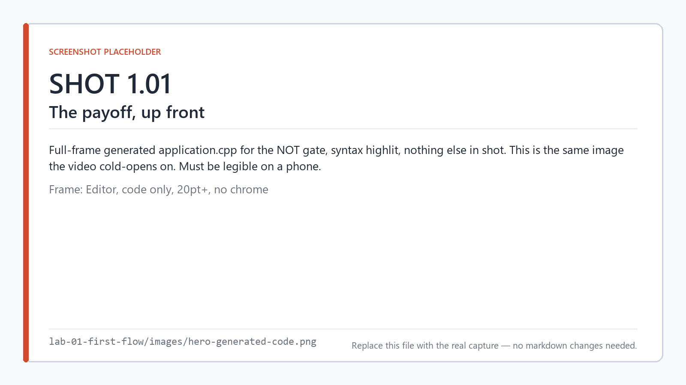

*The end of this lab: the entire program, as the compiler emitted it.*

## What you'll learn

- The five stages between a graph and a running binary, as files you can open
- How to validate, build, and simulate a project from the CLI and the editor
- What the generated C++ looks like, and what is deliberately absent from it
- Why the editor is a code generator and not a runtime
- How to read a validation diagnostic

## Before you start

If you have not read [Lab 0](../lab-00-concepts/), you may want to — it defines scan, task, node,
port, target, and the rest of the vocabulary this lab uses without stopping to explain. It takes
25 minutes and you build nothing. You can also just press on from here and go back when a word
stops making sense.

You need the SMFlow editor installed and `smflow` on your `PATH`
([installation](../../docs/getting-started/installation.md),
[CLI guide](../../docs/guide/cli.md)).

You also need a host C++ compiler — `g++` or `clang++` on your `PATH`, or Visual Studio with the
C++ workload. SMFlow's simulator does not interpret your graph; it compiles it and runs the real
binary ([ADR 0007](https://github.com/state-machine-flow/SMFlow/blob/main/docs/adr/0007-simulator-runs-generated-code.md)).
That design choice is the reason a toolchain is a prerequisite even for a lab with no hardware, and
it is also the reason simulator results are worth trusting.

Verify:

```
smflow targets
g++ --version
```

---

## Build it

### 1. Create the project

```
smflow new lab-01.smflow --name "Lab 01 - First Flow"
```

Or in the editor: **File → New Project**.

A new project contains one periodic task named `Main` with a 10 ms period and nothing else. Every
node you place has to live in some task — there is no "loose" logic — so the task exists from the

<!-- shot 1.02 -->
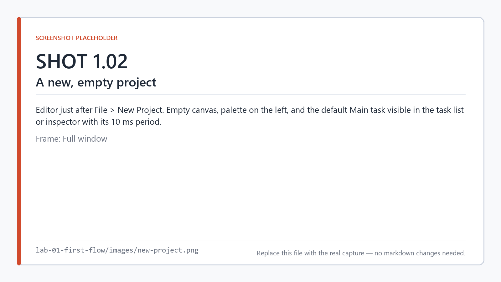

*A new project: an empty canvas and one 10 ms task named `Main`.*
start.

### 2. Place three nodes

In the editor, drag these from the palette onto the canvas, left to right:

| Node | Palette category | Rename it to |
|---|---|---|
| Digital Input | I/O | `StartButton` |
| NOT | Logic | *(leave it)* |
| Digital Output | I/O | `Motor` |

<!-- shot 1.03 -->


*The I/O category of the palette, with Digital Input selected.*

The equivalent from the CLI:

```
smflow add-node lab-01.smflow digital-input  --id start --name StartButton
smflow add-node lab-01.smflow not            --id not1
smflow add-node lab-01.smflow digital-output --id motor --name Motor
```

The names matter and the IDs do not. `StartButton` and `Motor` become the logical I/O points that
you will later bind to physical pins, and they appear verbatim in the generated C++. The node IDs
(`start`, `not1`, `motor`) are editor bookkeeping and have no effect on the program's meaning.

<!-- shot 1.04 -->
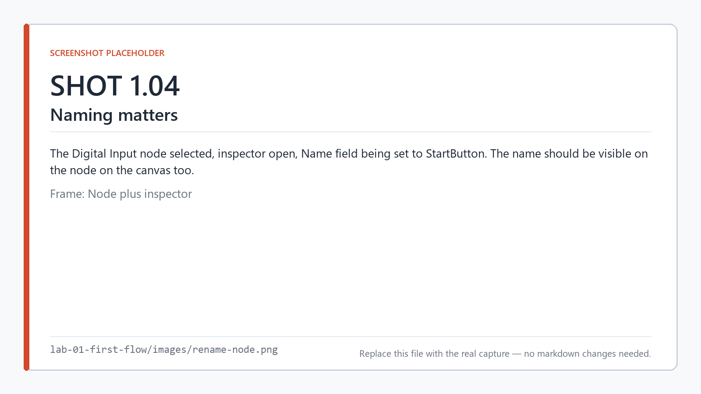

*Renaming the node to `StartButton` — this name reaches the generated C++.*

### 3. Wire them up

Drag from the output port of one node to the input port of the next:

<!-- shot 1.05 -->
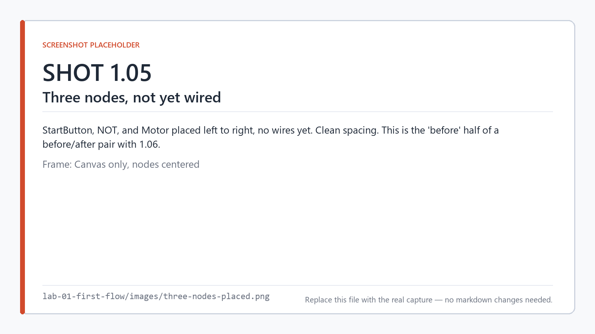

*Three nodes placed, nothing connected yet.*

```
StartButton.value → NOT.in
NOT.out           → Motor.value
```

```
smflow connect lab-01.smflow start:value not1:in
smflow connect lab-01.smflow not1:out    motor:value
```

Port IDs are case-sensitive and differ between node types. `digital-input` exposes `value`; `not`
exposes `in` and `out`. When in doubt, hover the port in the editor or run
`smflow` with the MCP server and ask it, rather than guessing.

<!-- shot 1.06 -->
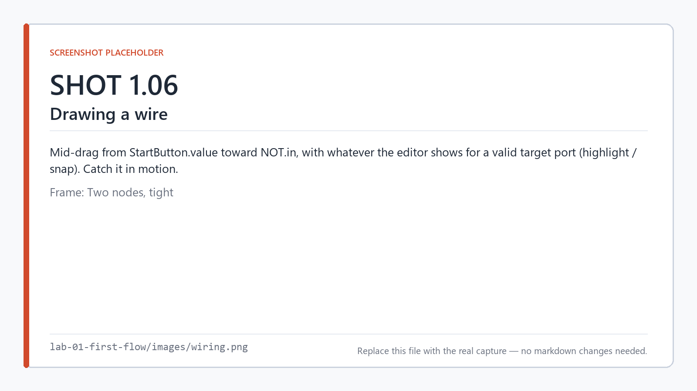

*Dragging a wire from `StartButton.value` to `NOT.in`.*

### 4. Validate

```
smflow validate lab-01.smflow
```

```
Lab 01 - First Flow: valid.
```

<!-- shot 1.08 -->
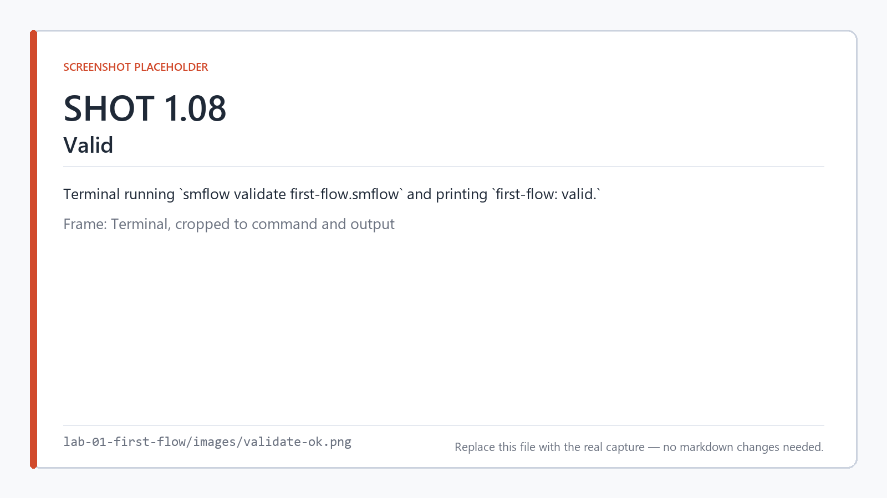

*Validation passes.*

Validation is not a lint pass you can skip. An invalid graph cannot produce code at all — there is
no partial build and no best-effort fallback. We will prove that in **Break it**, below.

<!-- shot 1.07 -->
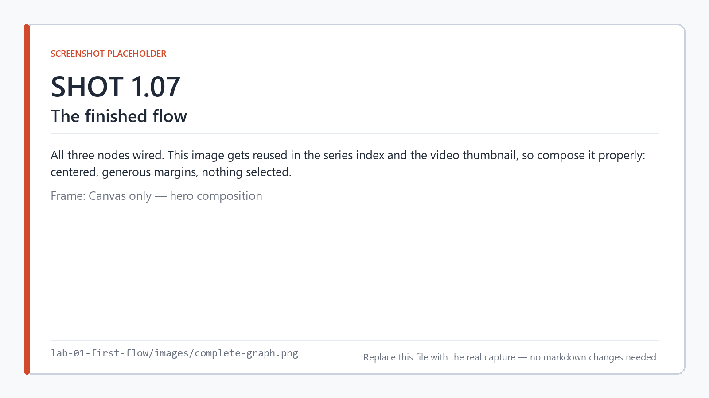

*The finished flow.*

---

## Run it

```
smflow simulate lab-01.smflow
```

The simulator compiles your flow to a host binary, runs it against a virtual I/O table and a
simulated clock, and lets you toggle `StartButton` and watch `Motor` respond. In the editor, **F5**
does the same thing in a docked panel.

Toggle `StartButton` on. `Motor` goes off. Toggle it off. `Motor` comes on. That is the whole
program, and it works.

<!-- shot 1.09 -->
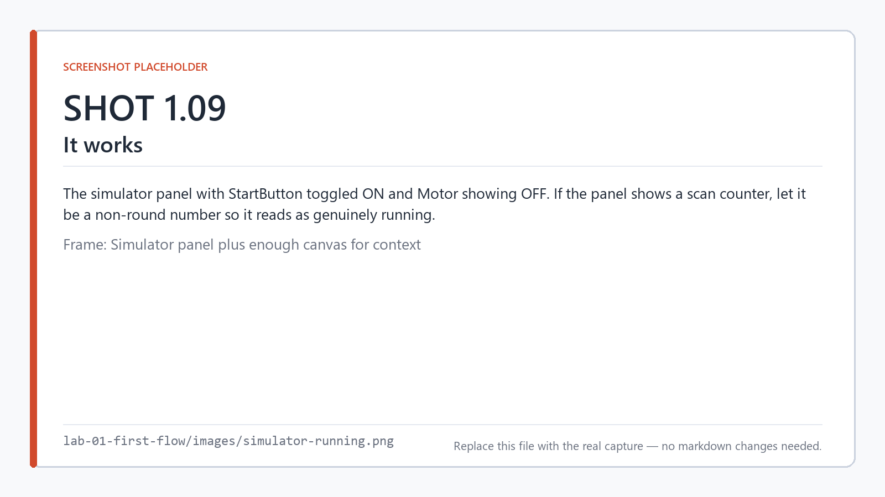

*`StartButton` on, `Motor` off. The program running in the simulator.*

There is also a test suite for it:

```
smflow test lab-01.smflow
```

`.smtest` files are covered properly in a later series; for now, note that the behavior you just
checked by hand can be checked by CI instead.

---

## Look at the code

This is the part that matters.

```
smflow build lab-01.smflow --target linux-x64 --emit-only
```

`--emit-only` generates the C++ without invoking the cross-compiler, so you do not need a Linux
toolchain on a Windows machine to read the output. Five files land in `generated/`:

| File | What it holds |
|---|---|
| `application.h` | Task entry points and the diagnostics struct |
| `application.cpp` | **Your logic** |
| `hardware.h` / `hardware.cpp` | The I/O table and the platform layer |
| `main.cpp` | The scheduler and the scan loop |

<!-- shot 1.10 -->
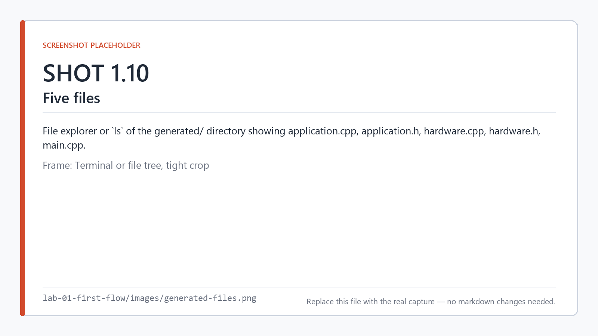

*Five files, and no sixth one you have to ship alongside them.*

Open `application.cpp`:

```cpp
// Generated by SMFlow. Do not edit — this file is overwritten by the next build.

#include "application.h"

namespace smflow
{

void MainTask(IO& io)
{
    const bool startButton = io.StartButton;

    io.Motor = !startButton;
}

}  // namespace smflow
```

That is your graph. Three nodes became two lines, and the second one is the specification written
in C.

<!-- shot 1.11 -->
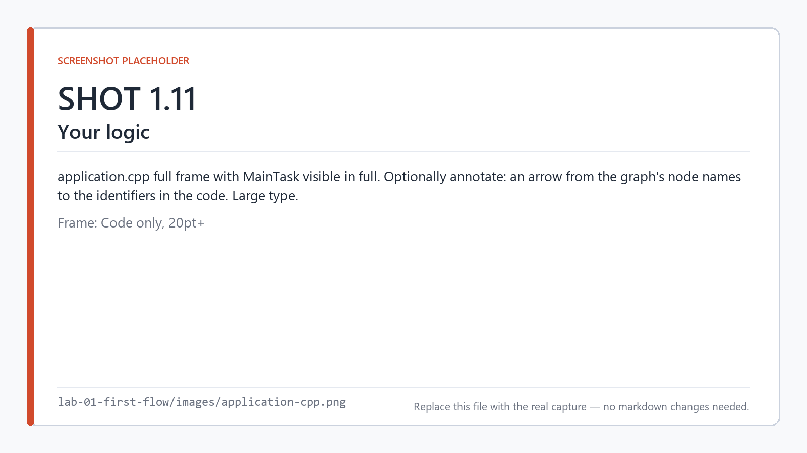

*`application.cpp` — your graph, compiled.*

Read it carefully, because several things are true about it at once:

**Your names survived.** `StartButton` and `Motor` are right there. A firmware engineer reviewing
this diff does not need the graph open to know what it does.

**The NOT node is gone.** There is no object representing it, no function call, no table entry. It
was compiled away into the `!` operator, which is what a `!` operator is for. Nodes are a notation
for the program, not a structure in it.

**There is no graph in the generated code.** Search the whole `generated/` directory for the words
`Node`, `Graph`, `ExecuteNode`, `Runtime`, `Interpreter`, or `ScriptEngine`:

```
grep -rnE '\b(Node|Graph|ExecuteNode|Runtime|Interpreter|ScriptEngine)\b' \
     --include='*.cpp' --include='*.h' generated/
```

Nothing. There is no node registry, no dispatch loop, no visitor, no interpreter. The controller
never learns that a graph existed.

<!-- shot 1.12 -->
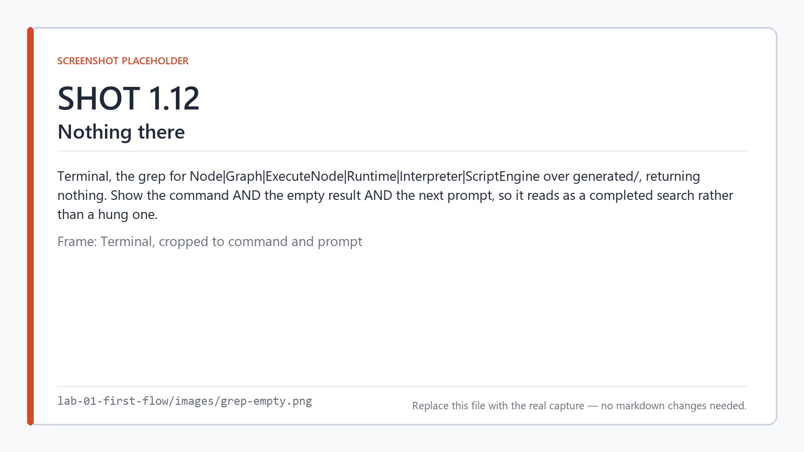

*No interpreter, no dispatch loop, no graph. Nothing matches.*

**There is no SMFlow on the target.** No .NET, no Node.js, no Python, no JVM, no SMFlow runtime
library. The artifact is a self-contained native binary. If SMFlow vanished tomorrow, the C++ in
this folder would still compile and still run, and you could maintain it by hand.

### The scan loop

Now open `main.cpp` and find the bottom of `main()`:

```cpp
while (stopRequested == 0)
{
    // One input snapshot per tick, shared by every task that runs in it.
    smflow::ReadInputs(io);

    if (elapsedMs % 10ull == 0)
    {
        const std::uint64_t started = smflow::Now();
        smflow::MainTask(io);
        Account(diagnostics[0], started);
    }

    smflow::WriteOutputs(io);

    elapsedMs += kTickMs;
    Advance(deadline, kTickMs);
    SleepUntil(deadline);
}
```

Read inputs, run the task, write outputs, sleep until the next absolute deadline. If you have
written a PLC scan loop or a bare-metal superloop, you have written this function. Lab 2 takes it
apart properly; for now just notice that it is a loop you could have written, with comments
explaining the decisions — including why the sleep is against an absolute deadline rather than a
relative one, and why the signal handler stops the loop at a scan boundary instead of mid-cycle.

<!-- shot 1.13 -->
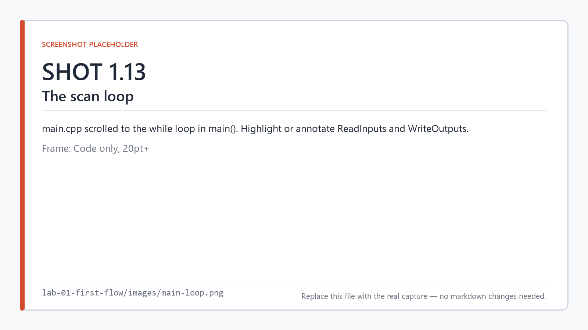

*The scan loop in `main.cpp`.*

The generated code also argues against itself where it should. In `application.h`:

```cpp
/// Per-task counters, maintained by the scheduler.
///
/// `overruns` counts scans that took longer than the task's declared budget;
/// `deadlineMisses` counts scans that began after the next period was already
/// due. Both are measured with Now() on the target. Neither is a real-time
/// guarantee — they are observations after the fact.
```

That distinction — measured versus guaranteed — is the subject of Lab 3, and SMFlow is careful
about it everywhere, including in its own output.

### What the pipeline actually was

You have now seen every stage as a real artifact:

```
lab-01.smflow   →  the graph you drew, serialized
      ↓                 (validation runs here — nothing proceeds until it passes)
   typed IR          →  an ordered, hardware-agnostic operation list
      ↓                 (target lowering runs here — linux-x64 decides what a pin is)
 generated/*.cpp     →  ordinary C++17
      ↓
   native binary     →  the thing that ships
```

The `.smflow` file is not the IR, and neither of them is the C++. They are three different
representations with three different jobs, and keeping them separate is what lets the same graph
build for a Pico and an Arduino Opta without either board leaking into the compiler (Lab 9).

### Determinism, checked

Build it twice and compare:

```
smflow build lab-01.smflow --target linux-x64 --emit-only --out build-a
smflow build lab-01.smflow --target linux-x64 --emit-only --out build-b
diff -r build-a build-b
```

No output. The same project produces byte-identical C++ every time: no timestamps, no generated
IDs, no dictionary iteration order leaking into the emission. This is what makes the generated code
reviewable in a pull request — a diff shows what you changed in the graph and nothing else.

<!-- shot 1.14 -->
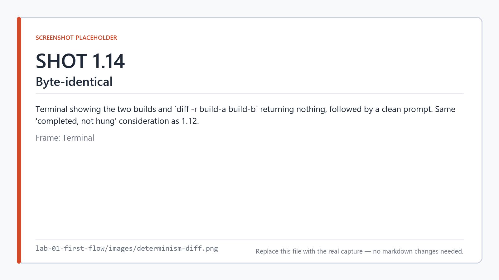

*Two independent builds, byte for byte identical.*

---

## Break it

Delete the wire between `NOT` and `Motor`, then validate:

```
smflow validate lab-01.smflow
```

```
error SMF0005: Required input 'value' on Digital Output node 'motor' is not connected. [node motor]
```

Three things to notice:

1. **The build did not produce code.** It did not emit a `Motor` that holds its last value, or
   defaults to `false`, or warns and carries on. It refused.
2. **The diagnostic names the node.** `[node motor]` — in the editor this selects and highlights
   it on the canvas.
3. **The error has a code.** `SMF0005` is stable and greppable, which matters when you are
   triaging a CI failure at 2 a.m.

<!-- shot 1.15 -->
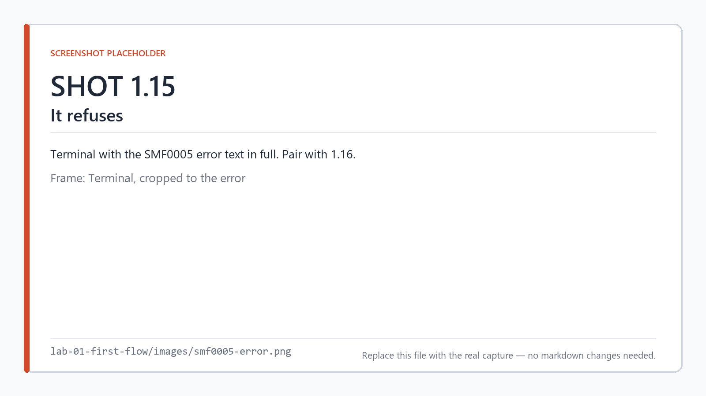

*The build refuses, and tells you exactly why.*

Reconnect the wire and validate again.

<!-- shot 1.16 -->
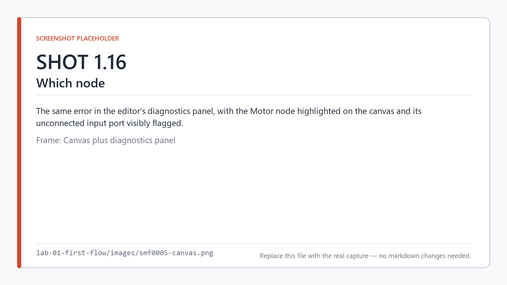

*The same error in the editor, with the offending node highlighted.*

Now try a different failure. Add a second `digital-output` node and wire `NOT.out` to it as well,
then wire `StartButton.value` directly to the *first* `Motor` as a second input. An input port
accepts exactly one connection — the editor will refuse the second wire outright rather than let
you draw something that cannot mean anything.

---

## On your own

Change the program to `Motor = StartButton AND GuardClosed`:

- Add a second `digital-input` named `GuardClosed`
- Replace the `not` node with an `and` node (ports: `a`, `b`, `out`)
- Rebuild with `--emit-only` and read `application.cpp` again

You should see three locals and one assignment, in an order that follows the dataflow. Predict the
generated code before you look at it. If your prediction is right, you have the model.

A finished version is in [`solution/`](solution/).

<!-- shot 1.17 -->
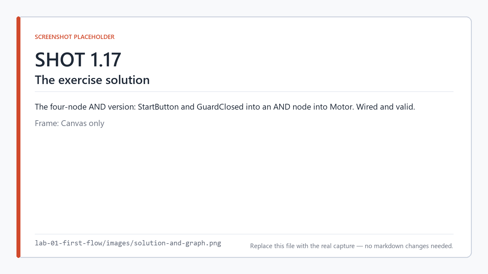

*The AND-gate solution.*

---

## What just happened

**SMFlow is a compiler, not a runtime.** The graph is source code in the ordinary sense: it is
parsed, type-checked, lowered to an intermediate representation, and translated to a target
language ahead of time. The thing that runs on the controller has no idea it came from a picture.

This has consequences you will feel for the rest of the series:

- **You can review the output.** The generated C++ goes in the repo, goes through pull request, and
  gets read by people who do not use SMFlow. Determinism is what makes that diff meaningful.
- **An invalid graph is not runnable.** There is no "it compiles, we'll see what happens." The
  gate is at validation, before codegen.
- **The editor is optional.** Everything in this lab ran from the CLI. The editor is a convenient
  way to author a `.smflow` file; it is never required to build one, and a build server does not
  install it.
- **Nothing is reserved for later.** No runtime library means no version skew between your tool and
  your controller, and no "SMFlow 2.0 requires a firmware update" conversation.

The cost of this design is the one you already paid: you need a C++ toolchain for the target, even
to simulate. SMFlow trades setup friction for the absence of an interpreter. For industrial and
embedded control, that is the right trade, and the rest of the series is built on it.

---

**Previous:** [Lab 0 — How SMFlow works](../lab-00-concepts/) ·
**Next:** [Lab 2 — The scan cycle](../lab-02-scan-cycle/) · [Series index](../README.md)
