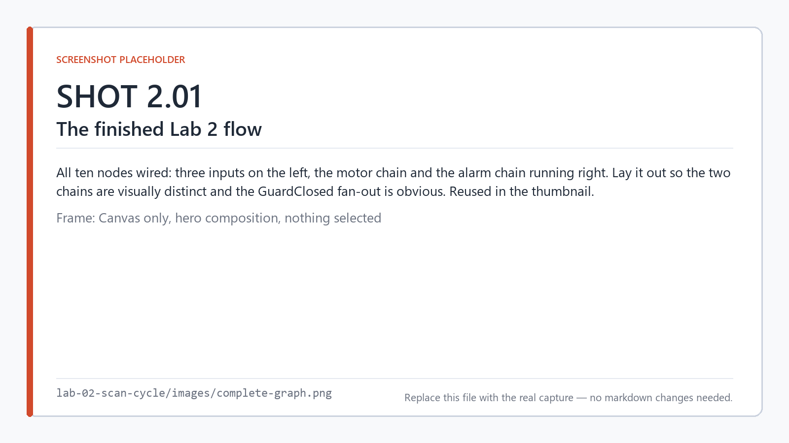
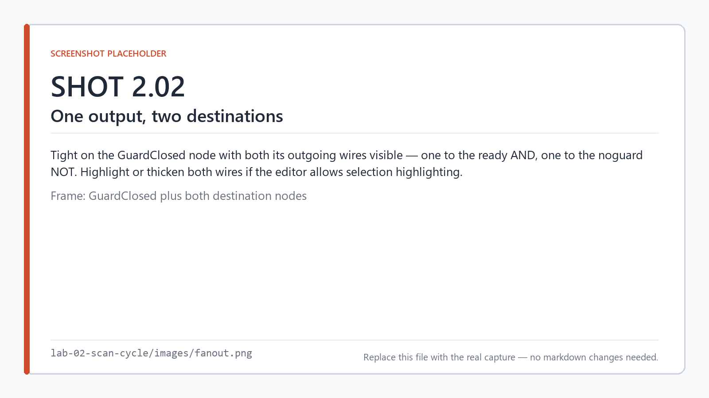
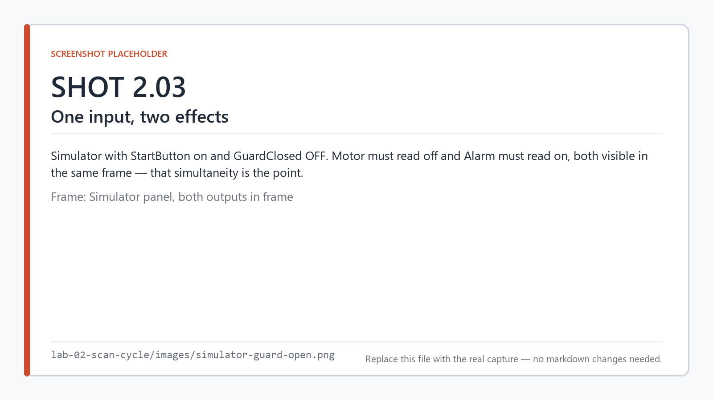
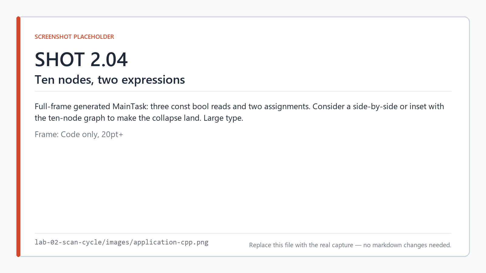
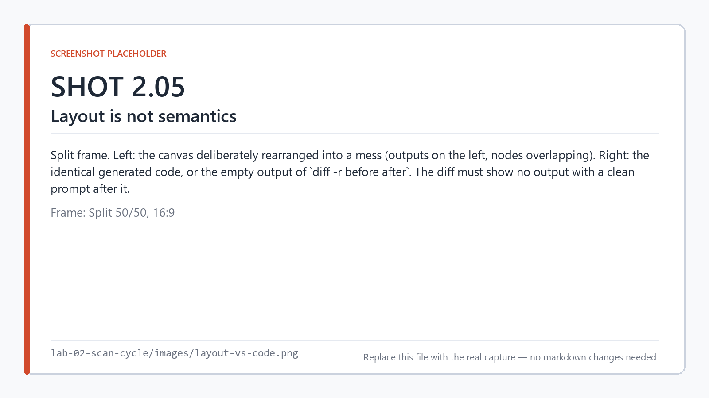
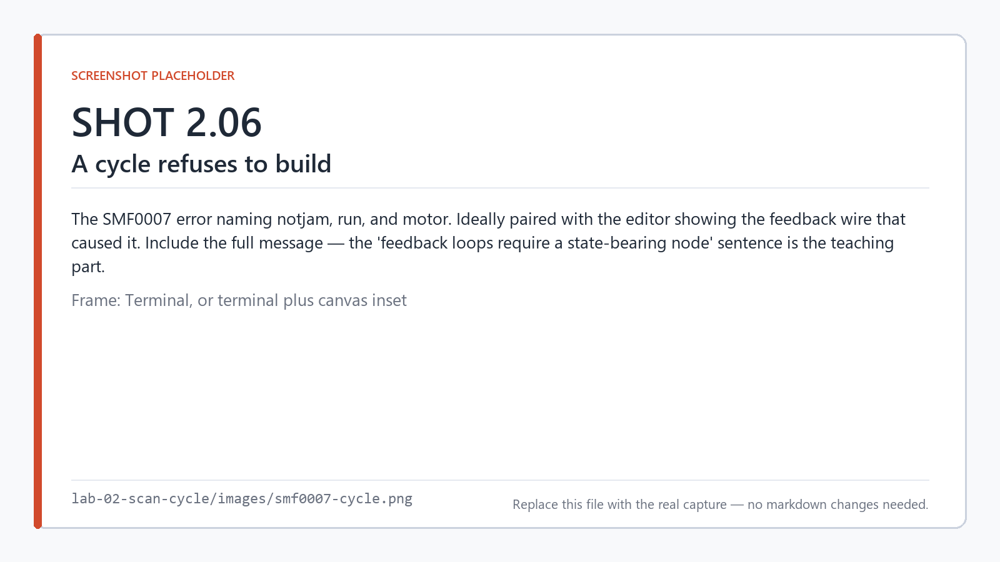

# Lab 2 — The scan cycle

**Time:** 20 minutes · **Hardware:** none · **License tier:** Free

**Previous:** [Lab 1 — Your first flow](../lab-01-first-flow/) · [Series index](../README.md)

---

## The problem

A conveyor motor runs when the operator has pressed start, the guard door is closed, and the jam
detector is clear. An alarm sounds if there is a jam, or if the guard is open.

```
Motor = StartButton AND GuardClosed AND NOT JamDetect
Alarm = JamDetect OR NOT GuardClosed
```

Ten nodes this time instead of three — enough that the graph has a shape, and enough that the
question "in what order does this run?" has a real answer.

That question is what this lab is about. In Lab 1 there was only one path through the graph, so
ordering was not interesting. Here there are two independent output chains that share inputs, and
you are going to find out exactly what determines the order they execute in — and, more usefully,
what *doesn't*.

## What you'll learn

- What one scan does, in the order it does it, as generated code
- That execution order comes from dataflow, not from where you put the nodes
- The one thing about your project file that *does* affect emission order, and why it is harmless
- Why a feedback loop is an error rather than an oscillator
- What happens to the intermediate nodes you drew

<!-- shot 2.01 -->


*The finished flow: two output chains sharing three inputs.*

---

## Build it

```
smflow new lab-02.smflow --name "Lab 02 - Scan Cycle"
```

### 1. The inputs

Three `digital-input` nodes, named `StartButton`, `GuardClosed`, and `JamDetect`.

```
smflow add-node lab-02.smflow digital-input --id start --name StartButton
smflow add-node lab-02.smflow digital-input --id guard --name GuardClosed
smflow add-node lab-02.smflow digital-input --id jam   --name JamDetect
```

### 2. The motor chain

`NOT` to invert the jam signal, then two `AND` nodes, then a `digital-output` named `Motor`.

```
smflow add-node lab-02.smflow not            --id notjam
smflow add-node lab-02.smflow and            --id ready
smflow add-node lab-02.smflow and            --id run
smflow add-node lab-02.smflow digital-output --id motor --name Motor

smflow connect lab-02.smflow jam:value    notjam:in
smflow connect lab-02.smflow start:value  ready:a
smflow connect lab-02.smflow guard:value  ready:b
smflow connect lab-02.smflow ready:out    run:a
smflow connect lab-02.smflow notjam:out   run:b
smflow connect lab-02.smflow run:out      motor:value
```

Note that `GuardClosed` now feeds two different places — `ready:b` here, and the alarm chain in a
moment. **An output port can fan out to as many inputs as you like.** It is only *inputs* that are
limited to one connection.

### 3. The alarm chain

```
smflow add-node lab-02.smflow not            --id noguard
smflow add-node lab-02.smflow or             --id fault
smflow add-node lab-02.smflow digital-output --id alarm --name Alarm

smflow connect lab-02.smflow guard:value   noguard:in
smflow connect lab-02.smflow jam:value     fault:a
smflow connect lab-02.smflow noguard:out   fault:b
smflow connect lab-02.smflow fault:out     alarm:value
```

<!-- shot 2.02 -->


*`GuardClosed` feeds two chains. Fan-out from an output is unlimited; fan-in to an input is not.*

### 4. Validate

```
smflow validate lab-02.smflow
```

```
Lab 02 - Scan Cycle: valid.
```

---

## Run it

```
smflow simulate lab-02.smflow
```

Work through the truth table by hand. Start on, guard closed, no jam — motor runs, alarm silent.
Open the guard — motor stops *and* the alarm sounds, because `GuardClosed` feeds both chains. Trip
the jam detector — motor stops, alarm sounds.

<!-- shot 2.03 -->


*Opening the guard affects both chains, because both read the same input.*

---

## Look at the code

```
smflow build lab-02.smflow --target linux-x64 --emit-only
```

Open `generated/application.cpp`:

```cpp
void MainTask(IO& io)
{
    const bool startButton = io.StartButton;
    const bool guardClosed = io.GuardClosed;
    const bool jamDetect = io.JamDetect;

    io.Motor = startButton && guardClosed && !jamDetect;
    io.Alarm = jamDetect || !guardClosed;
}
```

<!-- shot 2.04 -->


*Ten nodes, two expressions.*

Stop and compare that against what you drew.

**Ten nodes became two expressions.** `notjam`, `ready`, `run`, `noguard`, and `fault` — five
nodes, all of them intermediate — do not appear in the output at all. No variables, no temporaries,
nothing. They were structure in your drawing, and the compiler folded them into the expression
trees they described.

This is the same thing you saw in Lab 1 with a single `NOT`, but at a scale where it stops looking
like a coincidence. **A node is notation.** It tells the compiler the shape of an expression. It is
not an object, a function call, or a table entry in the program that results.

**The three inputs are read exactly once each**, at the top, into locals. `guardClosed` is read
once even though two chains consume it. `jamDetect` likewise. That is the input snapshot, and it is
the reason both chains are guaranteed to be looking at the same reality.

**The two outputs are assigned once each.** No output is written twice, no output is left
conditionally unwritten.

### Order comes from dataflow

Look at the order of those statements. Every input is read before the expressions that use them.
That is not a coincidence or a convention — it is a **topological sort** of the graph, computed at
compile time.

The compiler walks your graph, works out which nodes depend on which, and emits them in an order
where every value exists before it is used. There is no scheduler on the target deciding this. The
order is baked into the sequence of statements, and the controller just runs them top to bottom.

### What does *not* affect the order

Here is a claim worth testing rather than believing. Move the nodes around on the canvas — drag
them into a pile, put the outputs on the left, make it ugly — then rebuild and diff:

```
smflow build lab-02.smflow --target linux-x64 --emit-only --out before
# ... rearrange the canvas, save ...
smflow build lab-02.smflow --target linux-x64 --emit-only --out after
diff -r before after
```

Nothing. **Layout has no semantics.** Node positions, group boxes, colors, and zoom live in the
`ui` section of the project file and never reach the compiler. A graph that is beautifully laid out
and a graph that is a tangled mess compile to byte-identical code.

<!-- shot 2.05 -->


*Same graph, worse layout, byte-identical output.*

That matters more than it sounds. It means tidying up a diagram is never a risky change, and a
layout-only commit shows up in review as exactly what it is.

### The one thing that does

Now a nuance, because the honest version of this is more useful than the slogan.

`Motor` is emitted before `Alarm`. Why that way round? The two chains are completely independent —
neither consumes anything the other produces — so dataflow gives no reason to prefer either order.

The tiebreak is **declaration order in the project file**. If you reorder the `nodes` array, the
independent statements can come out in a different order:

```cpp
    io.Alarm = jamDetect || !guardClosed;     // ← Alarm first this time
    io.Motor = startButton && guardClosed && !jamDetect;
```

Three things to be clear about:

1. **The program is identical.** Both outputs are computed from the same snapshot and committed at
   the same instant, at the bottom of the scan. Nothing observable changes. Independent statements
   are independent.
2. **The build is still deterministic.** The same project file always produces the same output.
   The tiebreak is a *rule*, not a coin flip — that is the whole point of having one.
3. **You do not normally cause this.** The editor appends nodes; it does not reshuffle them. You
   would have to hand-edit the project file.

Determinism does not mean "there is only one possible ordering." It means **the ordering is a
function of the source, with nothing left to chance** — no hash iteration order, no timestamps, no
parallel-build nondeterminism. That is what makes the generated code reviewable, and it is the
precise claim SMFlow makes.

---

## Break it

### A feedback loop

Rewire `run:out` back into `notjam:in`, replacing the wire from `jam`. In ladder you would be
building an oscillator. Here:

```
error SMF0007: The graph contains a cycle involving 'notjam', 'run', 'motor'.
Feedback loops require a state-bearing node, which does not exist yet.
```

<!-- shot 2.06 -->


*A combinational loop is a compile error, and the diagnostic names the cycle.*

The error names **every node in the cycle**, which is what you need to find it in a large graph.

The reason this is an error and not a feature: a topological sort of a cyclic graph does not exist,
so there is no "correct" statement order to emit. A tool that accepted this would have to pick an
order arbitrarily and let the loop resolve over successive scans — which is exactly the kind of
behavior that works on the bench and fails at 3 a.m.

If you want state that carries across scans, you ask for it explicitly with a state-bearing node —
`set-reset`, `toggle`, `counter`, `ton`. Those are Labs 5 and 6, and they break the cycle honestly
because the compiler knows the value comes from *last* scan.

### Two writers on one output

Add a wire from `fault:out` to `motor:value`, leaving the existing one in place:

```
error SMF0006: Input 'motor.value' already has a connection; an input accepts at most one.
[fault.out -> motor.value]
```

The editor refuses to draw this at all. From the CLI you can create it in the file, and validation
catches it. Two sources for one input has no meaning — there is no rule for which wins — so it is
rejected rather than resolved.

Undo both and re-validate.

---

## On your own

Add a second condition to the alarm: it should also sound if the start button is pressed while the
guard is open — an operator trying to run the machine with the door up.

```
Alarm = JamDetect OR NOT GuardClosed OR (StartButton AND NOT GuardClosed)
```

Build it, then look at the generated expression before you read the solution. Two questions worth
sitting with:

1. How many nodes did you add, and how many new *statements* appeared in the C++?
2. `NOT GuardClosed` now appears twice in your graph. Does it appear twice in the generated code?

A finished version is in [`solution/`](solution/).

---

## What just happened

**One scan is: snapshot every input, evaluate, commit every output.** You have now seen all three
phases as real code, and seen that the middle phase is a flat list of statements with no scheduler
in it.

**Execution order is a topological sort of the dataflow, computed at compile time.** Values exist
before they are used because the compiler arranged it, not because anything checks at runtime.

**Layout is not semantics.** Where a node sits on the canvas affects nothing. The project file's
`ui` section is sealed off from the compiler, and you can prove it with `diff`.

**Determinism is a property of the rule, not of uniqueness.** Independent nodes have *some* order,
chosen by a documented tiebreak rather than by chance. Same source in, same bytes out — that is the
claim, and it is the one that matters for review.

**Intermediate nodes vanish.** Five of your ten nodes produced no code. They described expression
shape. The output is the expression, not a transcription of the diagram.

That last point is the one to carry forward. When you look at a SMFlow graph, you are not looking
at a runtime structure that will exist on the controller. You are looking at a notation for an
expression — and in the next two labs, for statements with state and timing in them.

---

**Previous:** [Lab 1 — Your first flow](../lab-01-first-flow/) ·
**Next:** [Lab 3 — Tasks and periods](../lab-03-tasks/) · [Series index](../README.md)
