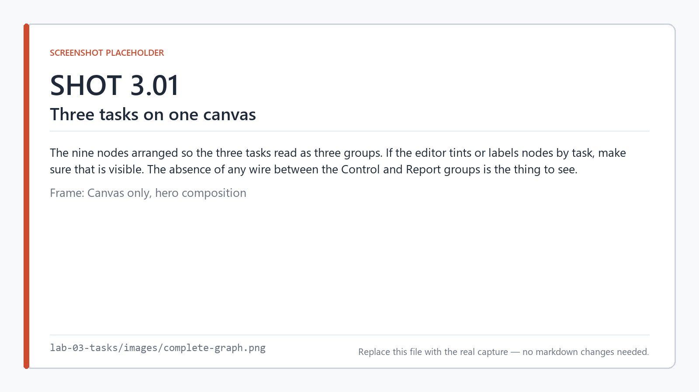
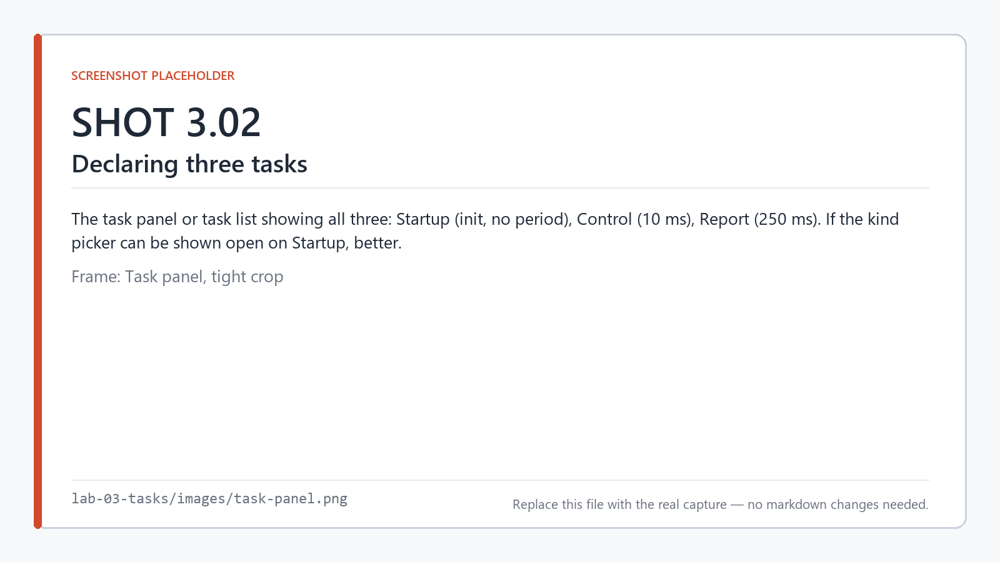
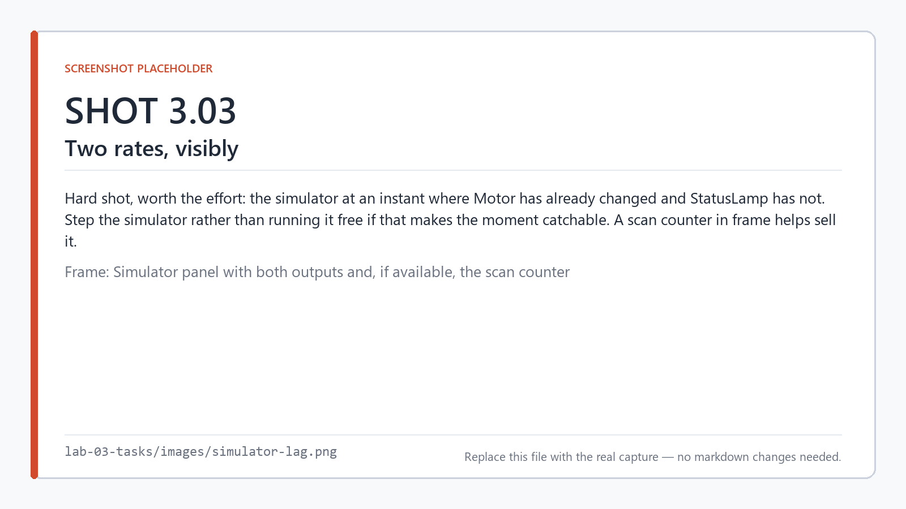
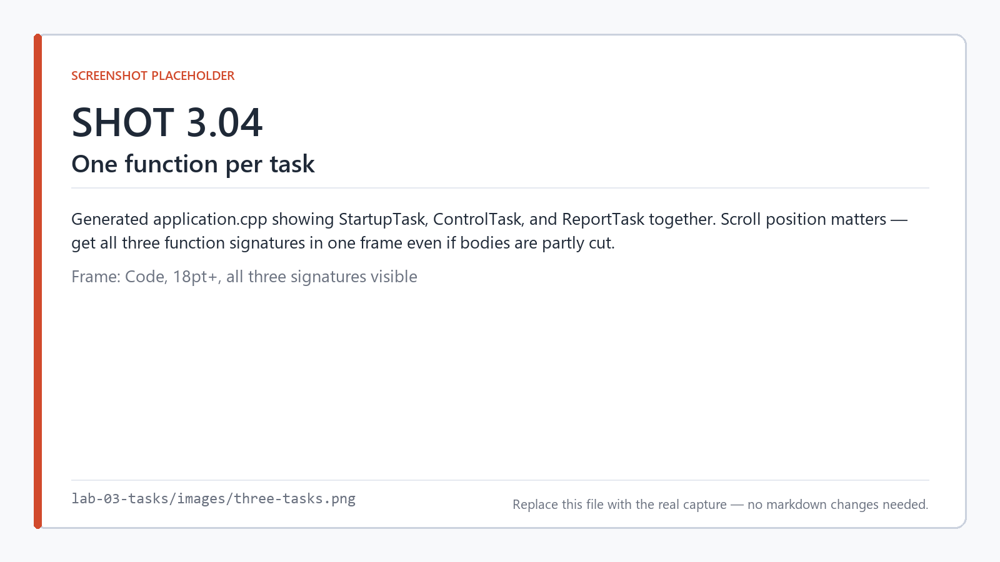
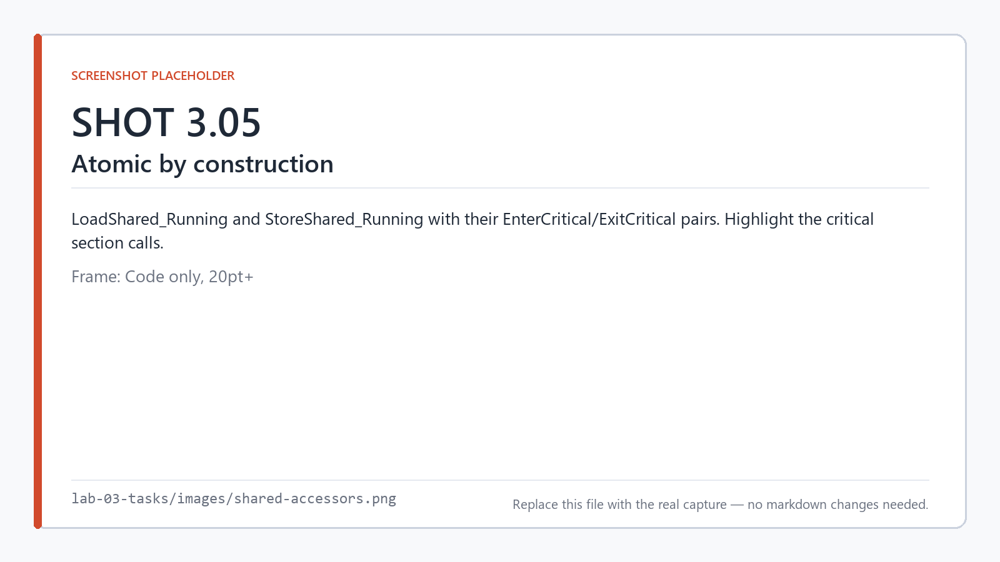
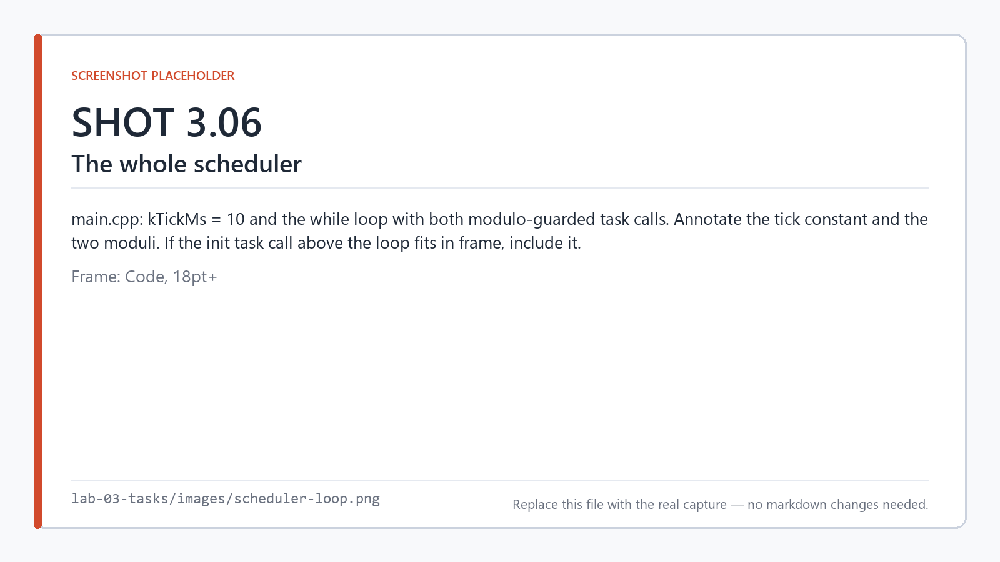
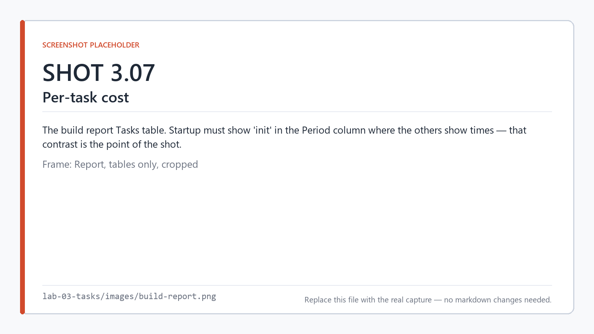
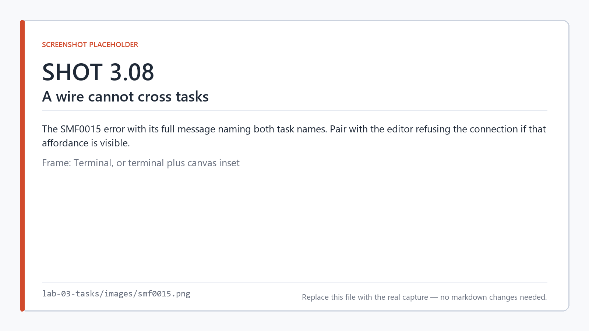

# Lab 3 — Tasks and periods

**Time:** 25 minutes · **Hardware:** none · **License tier:** Free

**Previous:** [Lab 2 — The scan cycle](../lab-02-scan-cycle/) · [Series index](../README.md)

---

## The problem

The conveyor control from Lab 2 needs to react quickly — a guard opening should stop the motor in
milliseconds. But the status lamp on the panel does not. Running the lamp logic at the same rate as
the safety logic is wasted work, and on a small microcontroller that waste is real.

So: two rates. Safety logic at 10 ms, reporting at 250 ms. And a bit of setup that must happen
once, before either of them starts.

```
Startup  (init)    seed the Running flag to a known state
Control  (10 ms)   Motor  = StartButton AND GuardClosed    →  Running
Report   (250 ms)  StatusLamp = Running
```

Two tasks need to share a value, and they cannot do it with a wire. That constraint is the heart of
this lab.

## What you'll learn

- How a task declares what it is and when it runs
- The three task kinds, and what an init task is for
- How the scheduler tick is derived, and what happens on a tick where only some tasks are due
- Why a wire cannot cross tasks, and what to use instead
- What the runtime measures about your tasks — and what those numbers are not

<!-- shot 3.01 -->


*Three tasks, nine nodes. The only thing connecting Control and Report is a shared variable.*

---

## Build it

```
smflow new lab-03.smflow --name "Lab 03 - Tasks and Periods"
```

### 1. Declare the tasks

A new project has one normal task named `Main`. You need three. In the editor this is the task
panel; the project file section looks like this:

```json
"tasks": [
  { "name": "Startup", "periodMs": 0,   "kind": "init" },
  { "name": "Control", "periodMs": 10 },
  { "name": "Report",  "periodMs": 250 }
]
```

<!-- shot 3.02 -->


*Three tasks. The init task has no period — it does not repeat.*

| Task | Kind | Period | Why |
|---|---|---|---|
| `Startup` | `init` | — | Runs once, before the first scan |
| `Control` | normal | 10 ms | Safety logic. Must react fast |
| `Report` | normal | 250 ms | Panel lamp. Human-speed |

An init task has **no period** because it does not repeat. A project may declare at most one — we
will come back to why.

### 2. Declare the shared variables

```json
"variables": [
  { "name": "Running",    "type": "bool", "initial": "false", "persistence": "none" },
  { "name": "FalseConst", "type": "bool", "initial": "false", "persistence": "none" }
]
```

`Running` is the real one: the Control task writes it, the Report task reads it.

`FalseConst` is an idiom worth knowing. There is no "constant" node in SMFlow — a constant is a
variable with an initial value and nothing that writes it. You will use this pattern whenever you
need a literal in a graph.

### 3. The Startup task

Two nodes: a `variable-read` of `FalseConst`, feeding a `variable-write` of `Running`.

```
smflow add-node lab-03.smflow variable-read  --id seed_src --name FalseConst --task Startup
smflow add-node lab-03.smflow variable-write --id seed     --name Running    --task Startup
smflow connect  lab-03.smflow seed_src:value seed:value
```

This seeds `Running` to a known state before anything reads it. Here that is belt-and-braces —
the variable already has an initial value — but it is the shape of the thing you will need the
moment setup gets real: putting a peripheral in a mode, latching an output safe, restoring a
retained value.

> **PLC readers:** this is your first-scan bit.
> **Arduino readers:** this is `setup()`.

### 4. The Control task

```
smflow add-node lab-03.smflow digital-input  --id start --name StartButton --task Control
smflow add-node lab-03.smflow digital-input  --id guard --name GuardClosed --task Control
smflow add-node lab-03.smflow and            --id andg                     --task Control
smflow add-node lab-03.smflow variable-write --id wrun  --name Running     --task Control
smflow add-node lab-03.smflow digital-output --id motor --name Motor       --task Control

smflow connect lab-03.smflow start:value andg:a
smflow connect lab-03.smflow guard:value andg:b
smflow connect lab-03.smflow andg:out    wrun:value
smflow connect lab-03.smflow andg:out    motor:value
```

The `and` output fans out to two places: the physical motor output *and* the shared variable.

### 5. The Report task

```
smflow add-node lab-03.smflow variable-read  --id rrun --name Running    --task Report
smflow add-node lab-03.smflow digital-output --id lamp --name StatusLamp --task Report
smflow connect  lab-03.smflow rrun:value lamp:value
```

### 6. Validate

```
smflow validate lab-03.smflow
```

```
Lab 03 - Tasks and Periods: valid.
```

---

## Run it

```
smflow simulate lab-03.smflow
```

Toggle `StartButton` and `GuardClosed` on. `Motor` responds immediately. `StatusLamp` follows —
but up to 250 ms later, because that is when its task next runs.

<!-- shot 3.03 -->


*A moment where `Motor` has changed and `StatusLamp` has not. That lag is the design, not a bug.*

Catching that lag in the act is worth doing. It is the first time in this series that two parts of
your program are visibly not in lockstep, and it is entirely under your control.

---

## Look at the code

```
smflow build lab-03.smflow --target linux-x64 --emit-only
```

### Three functions

`application.cpp` now has three task functions instead of one:

```cpp
void StartupTask(IO& io)
{
    (void)io;

    const bool t0 = LoadShared_FalseConst();

    StoreShared_Running(t0);
}

void ControlTask(IO& io)
{
    const bool startButton = io.StartButton;
    const bool guardClosed = io.GuardClosed;
    const bool t2 = startButton && guardClosed;

    StoreShared_Running(t2);
    io.Motor = t2;
}

void ReportTask(IO& io)
{
    const bool t0 = LoadShared_Running();

    io.StatusLamp = t0;
}
```

<!-- shot 3.04 -->


*One function per task, named after the task.*

Each task is an ordinary function named after the task. `ControlTask` computes the AND once into
`t2` and uses it twice — the same common-subexpression behavior from Lab 2.

### Crossing between tasks

The shared variable is not a bare global. It is a global behind an accessor:

```cpp
bool LoadShared_Running()
{
    EnterCritical();
    const bool value = g_shared.Running;
    ExitCritical();

    return value;
}

void StoreShared_Running(bool value)
{
    EnterCritical();
    g_shared.Running = value;
    ExitCritical();
}
```

<!-- shot 3.05 -->


*Every shared-variable access is atomic, generated for you.*

Every access is wrapped in a critical section. You did not ask for that and you cannot forget it.

> **Arduino readers:** this is the `volatile` plus `noInterrupts()` discipline you would otherwise
> apply by hand, and get wrong occasionally.

### The scheduler

Open `main.cpp`. First, above the loop:

```cpp
    smflow::InitializeHardware();

    // Runs once, before the first scan.
    smflow::ReadInputs(io);
    smflow::StartupTask(io);
    smflow::WriteOutputs(io);
```

There is the init task. It gets a full read/evaluate/write cycle of its own, once, before the loop
starts. It is not inside the loop and it is not conditional.

Now the loop:

```cpp
constexpr std::uint64_t kTickMs = 10;

...

while (stopRequested == 0)
{
    smflow::ReadInputs(io);

    if (elapsedMs % 10ull == 0)
    {
        const std::uint64_t started = smflow::Now();
        smflow::ControlTask(io);
        Account(diagnostics[0], started);
    }

    if (elapsedMs % 250ull == 0)
    {
        const std::uint64_t started = smflow::Now();
        smflow::ReportTask(io);
        Account(diagnostics[1], started);
    }

    smflow::WriteOutputs(io);

    elapsedMs += kTickMs;
    Advance(deadline, kTickMs);
    SleepUntil(deadline);
}
```

<!-- shot 3.06 -->


*The whole scheduler. Two `if` statements.*

**The tick is 10 ms** — the greatest common divisor of 10 and 250. Every task fires exactly on its
own period with no rounding.

**On 24 ticks out of 25, only `ControlTask` runs.** On every 25th, both run — `Control` first,
because it was declared first and nothing gives a reason to prefer otherwise.

**Inputs are still snapshotted once per tick**, shared by whichever tasks run in it. Two tasks at
different rates can never disagree about what the inputs were, because within a tick there is only
one answer.

**The init task has no diagnostics entry.** Only scheduled tasks get counters, because "did it meet
its period" is not a question you can ask about something that runs once.

### What gets measured

`application.h` declares a record kept per scheduled task:

```cpp
struct TaskDiagnostics
{
    uint32_t periodMs;
    uint32_t budgetMs;  // 0 when the task declares no budget
    uint32_t executions;
    uint32_t overruns;
    uint32_t deadlineMisses;
    uint64_t lastDurationMs;
};
```

The comment above it in the generated header is the important part:

> Both are measured with Now() on the target. Neither is a real-time guarantee — they are
> observations after the fact.

Read that again, because the distinction is the subject of this lab's closing section.

### The build report

```
  Task        Period      Nodes   Ops   State Size
  --------------------------------------------------------------------
  Startup     init        2       2     0 B
  Control     10 ms       5       5     0 B
  Report      250 ms      2       2     0 B
  --------------------------------------------------------------------
  Total: 3 task(s), 9 node(s), 9 operation(s), 0 B state
```

<!-- shot 3.07 -->


*Per-task cost. `Startup` shows `init` where the others show a period.*

---

## Break it

### Wire across tasks

Try to connect `andg:out` in Control directly to `lamp:value` in Report — the obvious thing to
want:

```
error SMF0015: 'andg.out -> lamp.value' runs from task 'Control' to task 'Report'.
A connection must stay within one task. [andg.out -> lamp.value]
```

<!-- shot 3.08 -->


*A wire cannot cross a task boundary.*

This is the rule worth understanding rather than memorizing. The two tasks run at different rates.
A wire between them would have to answer a question the picture does not show: does `Report` see
the value from the Control scan in the same tick, or the previous one, or the most recent one
whenever it happens to look?

A shared variable answers it unambiguously — **the most recent write, read at the instant the
`variable-read` node executes** — and puts that access somewhere you can see it on the canvas.

### A zero period

Set `Report`'s period to 0:

```
error SMF0009: Task 'Report' has period 0 ms; the period must be positive.
```

A normal task with no period is not a task, and the compiler will not guess that you meant `init`.

### Two init tasks

Add a second task with `"kind": "init"`:

```
error SMF0034: A project may declare at most one init task; this one declares 2:
'Startup', 'Startup2'.
```

"Before everything else" admits no ordering between two of them. Rather than inventing a tiebreak
for something that has no natural order, SMFlow refuses.

---

## On your own

Add a heartbeat so you can tell the controller is alive: a `blink` node in the `Report` task
driving a `Heartbeat` digital output, 500 ms on and 500 ms off.

Then answer these from the generated code:

1. `blink` carries state between scans. Where does that state live, and what is it called?
2. The build report's **State Size** column was `0 B` for every task. What is it now for `Report`?
3. Your blink is 500 ms on / 500 ms off inside a task that runs every 250 ms. What would happen if
   you set it to 100 ms, and why?

A finished version is in [`solution/`](solution/).

---

## What just happened

**A task is a unit of execution with a rule for when it runs.** Normal tasks repeat on a period,
init runs once before everything, interrupt runs on an edge outside the scan. Every node belongs to
exactly one.

**The tick is the GCD of every period.** The generated scheduler is a loop with one `if` per task,
and no runtime decision more complicated than a modulo.

**Tasks share data through variables, not wires.** The restriction is not arbitrary: a wire across
a rate boundary would hide a timing rule. A shared variable makes the access explicit and atomic.

**Scheduling is cooperative.** Tasks run to completion. Nothing preempts anything. A long scan in
one task delays every task due behind it.

**And now the part that matters most.** You have seen the runtime count overruns and deadline
misses. It is tempting to read that as a real-time guarantee. It is not.

- **Guaranteed:** the *logical* order. Control before Report on a shared tick, every input read
  before its consumers, same inputs and state producing the same outputs. Always.
- **Measured:** how long a scan actually took, counted on the target with its own clock, after the
  fact.
- **Not claimed:** that a deadline will be met. This is a cooperative loop in an ordinary process,
  not an RTOS with admission control.

Design for the order. Measure the time. Never confuse the two.

One footnote you will trip over if nobody says it: **in simulation, the overrun and deadline-miss
counters are structurally zero**, because a simulated scan consumes no simulated time. Those
numbers only mean something on hardware, which is Lab 8.

---

**Previous:** [Lab 2 — The scan cycle](../lab-02-scan-cycle/) ·
**Next:** [Lab 4 — Types and ports](../lab-04-types/) · [Series index](../README.md)
