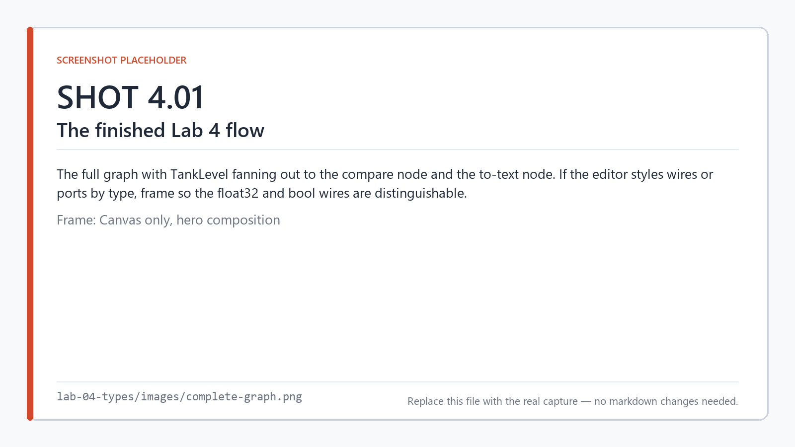
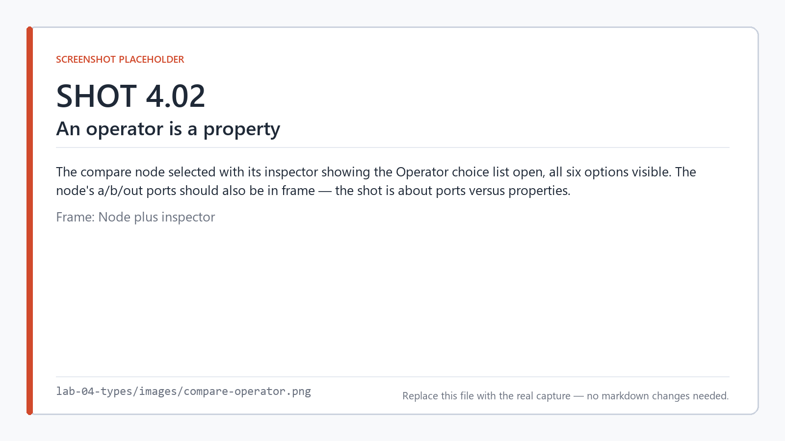
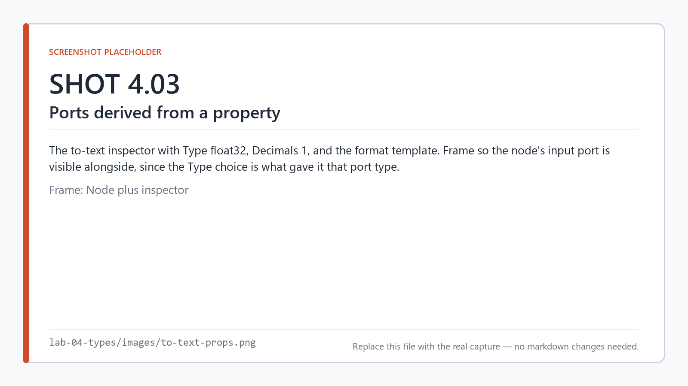
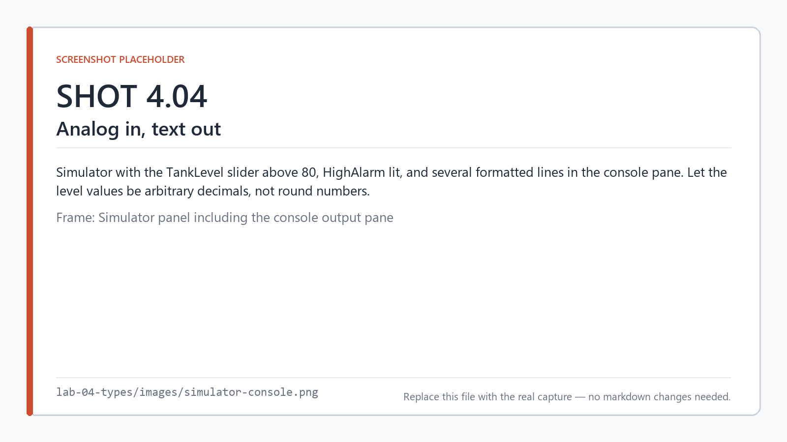
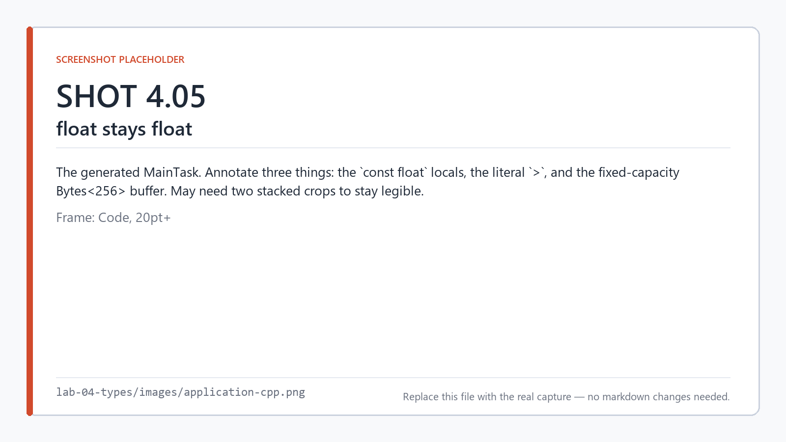
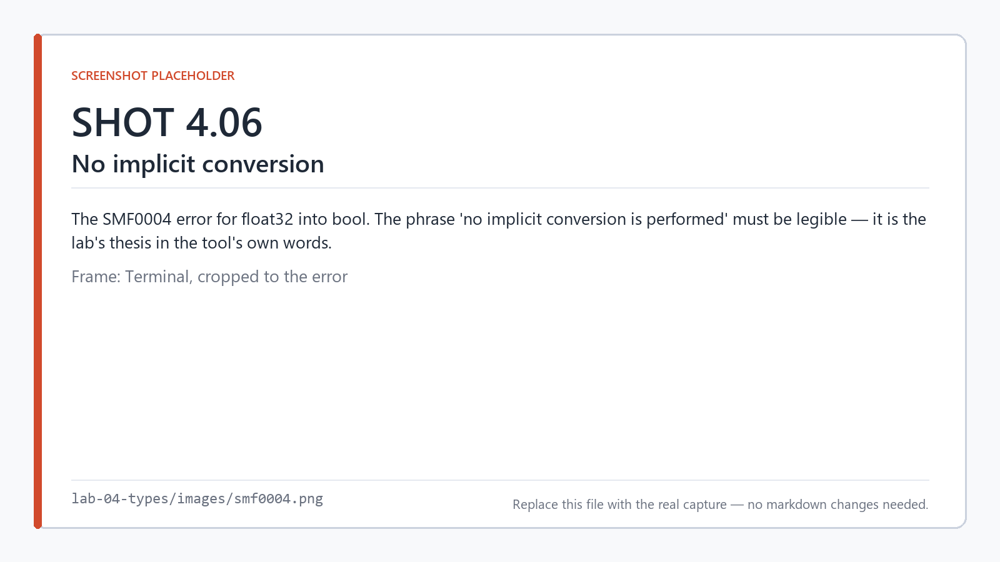
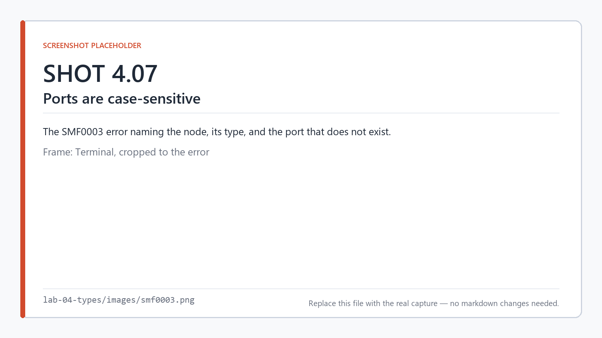

# Lab 4 — Types, ports, and why there are no silent conversions

**Time:** 25 minutes · **Hardware:** none · **License tier:** Free

**Previous:** [Lab 3 — Tasks and periods](../lab-03-tasks/) · [Series index](../README.md)

---

## The problem

A tank has a level sensor on an analog input, reading 0–100%. Raise a high-level alarm above a
setpoint, and print the level to a serial console once a second so an operator can watch it.

```
HighAlarm = TankLevel > HighSetpoint
Console   ← "Level: 62.5 %"  every second
```

Everything so far has been `bool`. This lab introduces a second type, and the moment you have two
types you have the question every control engineer has been burned by at least once: **what
happens when you connect things that do not match?**

The answer in SMFlow is "nothing happens, and it tells you." That sounds unhelpful. It is the most
useful thing in the type system.

## What you'll learn

- How a non-boolean value flows through a graph
- Properties versus ports, now that you have a node with interesting properties
- Why an exact-match type rule beats a conversion rule
- What `.iomap` is for, and why the serial console lives there
- Four different ways to get a connection wrong, and the four different diagnostics

<!-- shot 4.01 -->


*One `float32` source feeding two consumers: a threshold test and a text formatter.*

---

## Build it

```
smflow new lab-04.smflow --name "Lab 04 - Types and Ports"
```

Set the task period to 100 ms. Ten samples a second is plenty for a tank.

### 1. The setpoint

A `float32` variable with an initial value, used as a constant — the idiom from Lab 3, now with a
number that matters:

```json
"variables": [
  { "name": "HighSetpoint", "type": "float32", "initial": "80.0", "persistence": "none" }
]
```

Making the setpoint a variable rather than burying `80.0` in a node property is deliberate. A
variable can be read, displayed, and — once you reach Lab 11 — retained across a power cycle and
changed by an operator. A property cannot: it is fixed at compile time.

### 2. The alarm chain

```
smflow add-node lab-04.smflow analog-input   --id level --name TankLevel
smflow add-node lab-04.smflow variable-read  --id sp    --name HighSetpoint
smflow add-node lab-04.smflow compare        --id cmp
smflow add-node lab-04.smflow digital-output --id alarm --name HighAlarm
```

Select the `compare` node and set its **Operator** property to `>`.

<!-- shot 4.02 -->


*The operator is a property — a choice made at compile time, not a value arriving on a wire.*

This is the port-versus-property distinction from Lab 0, now concrete. The compare node's two
values arrive on **ports** and can differ every scan. Its operator is a **property**: fixed when
you build, baked into the emitted expression. There is no wire that can change `>` into `<` at
runtime, and that is a feature — it means the comparison in the generated C++ is a literal `>`.

```
smflow connect lab-04.smflow level:value cmp:a
smflow connect lab-04.smflow sp:value    cmp:b
smflow connect lab-04.smflow cmp:out     alarm:value
```

Note the types as you go. `analog-input.value` is `float32`. `compare.a` and `compare.b` are
`float32`. `compare.out` is `bool`. `digital-output.value` is `bool`. Every connection is an exact
match — the compare node is where the type *changes*, and it changes because comparing two numbers
genuinely produces a truth value.

### 3. The reporting chain

```
smflow add-node lab-04.smflow digital-input --id enable --name ReportEnable
smflow add-node lab-04.smflow blink         --id beat
smflow add-node lab-04.smflow to-text       --id txt
smflow add-node lab-04.smflow serial-tx     --id con --name Console
```

Set the properties:

| Node | Property | Value |
|---|---|---|
| `beat` | High time | `1000` |
| `beat` | Low time | `1000` |
| `txt` | Type | `float32` |
| `txt` | Decimals | `1` |
| `txt` | Format | `Level: {} %\n` |

<!-- shot 4.03 -->


*`to-text` is configured entirely by properties — its input port's type comes from the Type choice.*

`to-text` is a good example of a node whose **ports are derived from its properties**. Setting
Type to `float32` is what gives it a `float32` input port. Change the property and the port
changes with it. The node catalog cannot tell you this node's port types in the abstract — only an
instance of it has them.

```
smflow connect lab-04.smflow enable:value beat:IN
smflow connect lab-04.smflow level:value  txt:value
smflow connect lab-04.smflow txt:text     con:data
smflow connect lab-04.smflow beat:Q       con:send
```

`TankLevel` now fans out to two consumers: the comparison and the formatter.

### 4. Bind the hardware

A serial console is not something a node can conjure. It is a physical endpoint, so like every
physical resource it is declared in the project's bindings — in a `lab-04.iomap` file beside the
project:

```json
{
  "formatVersion": 1,
  "project": "Lab 04 - Types and Ports",
  "bindings": {
    "linux-x64": { "TankLevel": "analog0", "ReportEnable": "gpio0", "HighAlarm": "gpio1" },
    "simulator": { "TankLevel": "virtual.TankLevel", "ReportEnable": "virtual.ReportEnable",
                   "HighAlarm": "virtual.HighAlarm" }
  },
  "serial": {
    "linux-x64": { "Console": { "bus": "console", "baud": 115200,
                                "txCapacity": 64, "txBufferOctets": 64 } },
    "simulator": { "Console": { "bus": "virtual.uart0", "baud": 9600,
                                "txCapacity": 64, "txBufferOctets": 64 } }
  }
}
```

Lab 8 covers `.iomap` properly. Two things to notice now:

- **The file is paired with the project by filename.** `lab-04.smflow` ↔ `lab-04.iomap`. Copy the
  project to a new name without copying the map and the bindings go missing.
- **Bindings are per target.** The same `Console` is the stdout console on Linux and a virtual
  UART in the simulator. Nothing in the graph changes.

### 5. Validate

```
smflow validate lab-04.smflow
```

```
Lab 04 - Types and Ports: valid.
```

---

## Run it

```
smflow simulate lab-04.smflow
```

Turn `ReportEnable` on. Drag `TankLevel` up and down and watch the console:

```
Level: 41.3 %
Level: 62.5 %
Level: 81.0 %
```

`HighAlarm` comes on as you cross 80.

<!-- shot 4.04 -->


*An analog input driving both a threshold and a formatted console line.*

---

## Look at the code

```
smflow build lab-04.smflow --target linux-x64 --emit-only
```

```cpp
void MainTask(IO& io, State& state)
{
    const bool reportEnable = io.ReportEnable;
    const float tankLevel = io.TankLevel;
    const float t2 = LoadShared_HighSetpoint();

    io.HighAlarm = tankLevel > t2;
    const uint64_t t4 = Now();
    const bool t5 = state.s1_running;
    const uint64_t t6 = state.s1_started;
    const uint64_t t8 = reportEnable ? (t5 ? t6 : t4) : 0ull;
    const uint64_t t11 = (t4 - t8) % (1000ull + 1000ull);
    const bool t13 = reportEnable && t11 < 1000ull;

    state.s1_running = reportEnable;
    state.s1_started = t8;
    smflow::Bytes<256> t15{};
    smflow::append_text(t15, "Level: ");
    smflow::append_bytes(t15, smflow::to_text(tankLevel, 1));
    smflow::append_text(t15, " %\n");
    const bool t16 = state.s2_prev_send;

    (void)serial::ConsoleAdmit(t13 && !t16, t15);
    state.s2_prev_send = t13;
}
```

<!-- shot 4.05 -->


*The generated task. Note `float` where you had `float32`, and a literal `>`.*

Things worth seeing here:

**`float32` became `float`.** The type you drew is the type that was emitted. No boxing, no
variant, no `double` promotion you did not ask for.

**The comparison is a literal `>`.** Your property choice became an operator in the source. There
is no comparison function, no operator enum, no switch at runtime.

**The text buffer is fixed-capacity.** `smflow::Bytes<256>` — a stack-allocated, bounded buffer.
No `std::string`, no heap, no allocation that can fail halfway through a scan on a part with 2 KB
of RAM.

**The format template was unrolled at compile time.** `"Level: {} %\n"` became three calls:
literal, value, literal. There is no format-string parser on the target.

**The console write is guarded by an edge.** `t13 && !t16` — send only on the rising edge of the
blink, not every scan it happens to be high. The `serial-tx` node did that for you, and
`ConsoleAdmit` returns a bool you can ignore because the generated code already handled the case
where the buffer is full.

---

## Break it

Four mistakes, four diagnostics. Make each one, read the error, undo it.

> Edit `lab-04.smflow` in place rather than saving a copy under a new name — the `.iomap` is paired
> by filename, and a renamed project loses its bindings and reports a confusing extra error.

### 1. A float into a bool

Delete the wire into `HighAlarm` and connect `level:value` there instead — the analog reading
straight into a digital output.

```
error SMF0004: Cannot connect float32 to bool; no implicit conversion is performed.
[level.value -> alarm.value]
```

<!-- shot 4.06 -->


*No implicit conversion. The error says so in those words.*

Think about what the alternatives would have been. C would convert it: nonzero becomes true, so
the alarm is on whenever the tank is not exactly empty, including when the sensor reads 0.3%
noise. A tool trying to be helpful might insert a threshold at some value it picked. Both of those
are a silent decision about your plant made by a program that has never seen your plant.

SMFlow does neither. If you want a float to become a bool, you say *where* the threshold is — with
a `compare` node — and that threshold is visible on the canvas to whoever reviews it.

### 2. A bool into a float

Connect `enable:value` to `txt:value`:

```
error SMF0004: Cannot connect bool to float32; no implicit conversion is performed.
[enable.value -> txt.value]
```

Same code, opposite direction. There is no promotion rule either — the type system is symmetric
and boring, which is what you want from a type system.

### 3. A port that does not exist

Try connecting `cmp:result` (the compare node's output is called `out`):

```
error SMF0003: Node 'cmp' of type 'compare' has no port 'result'. [cmp.result -> alarm.value]
```

<!-- shot 4.07 -->


*Port IDs are case-sensitive and vary per node type.*

Port IDs are not standardized across node types, and they are case-sensitive. `not` has `in`/`out`;
`and` has `a`/`b`/`out`; `ton` has `IN`/`Q`/`ET` in capitals. Hover the port in the editor rather
than guessing.

### 4. A property value that is not allowed

Set the compare node's operator to `~=`:

```
error SMF0014: Operator of '~=' on Compare node 'cmp' is not one of
'==', '!=', '<', '<=', '>', '>='. [node cmp]
```

The diagnostic lists the whole allowed set. Properties are validated as strictly as connections —
a Choice property is a closed set, not a free-text field that gets interpreted later.

---

## On your own

Add a low-level alarm using a second setpoint of 20%, and change the console line to report both
the level and whether the tank is in range.

- A second `float32` variable, `LowSetpoint`, initial `20.0`
- A second `compare` with operator `<`
- A `LowAlarm` digital output
- Extend the format template

Then, from the generated code:

1. `TankLevel` now feeds three consumers. How many times is `io.TankLevel` read?
2. You have two `compare` nodes with different operators. Did the compiler emit a shared helper, or
   two literal comparisons?

A finished version is in [`solution/`](solution/).

---

## What just happened

**Types are exact-match, with no implicit conversion in either direction.** Not "mostly", not
"except for the safe ones". If two ports do not have the same type, the connection is an error.

This feels restrictive for about an hour, and then it stops costing you anything, because the
situations where you genuinely want a conversion are situations where you also want to say *how*.
Where is the threshold? How many decimals? Round or truncate? Those are engineering decisions, and
a compiler that answers them for you is a compiler making engineering decisions you did not review.

The cases it catches are real ones. A `duration` cannot be wired into an integer input, so a
counter can never be mistaken for a timer preset. A raw analog reading cannot become a boolean
without a visible threshold. A sensor value cannot silently truncate to an integer and lose the
fraction you were about to alarm on.

**Properties and ports are different things.** Ports are dataflow and change every scan. Properties
are configuration, fixed at compile time, and end up as literals in the emitted code. Some nodes —
`to-text`, `select`, `variable-read` — even derive their port *types* from a property, which is why
the node catalog can only tell you so much and an instance tells you the rest.

**Physical resources live in bindings, not in the graph.** The serial console is a target-specific
endpoint described in `.iomap`. The graph names `Console` and stays the same across every board.

**The generated code is still ordinary C++.** Floats are `float`. The comparison is `>`. Text goes
into a fixed-capacity buffer with no heap. Nothing about adding a second type made the output less
reviewable — which was the point of making the type system strict in the first place.

---

**Previous:** [Lab 3 — Tasks and periods](../lab-03-tasks/) ·
**Next:** Lab 5 — State: latches, counters, and edges · [Series index](../README.md)
