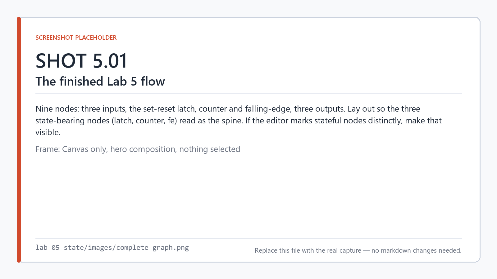
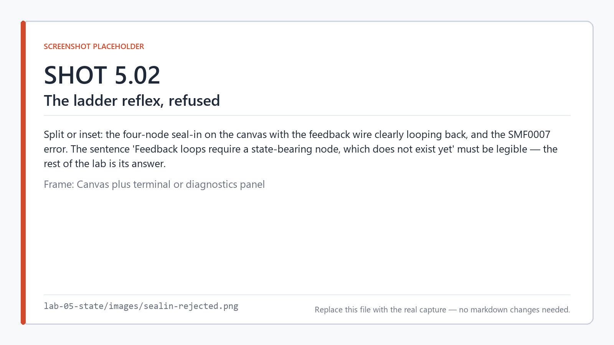
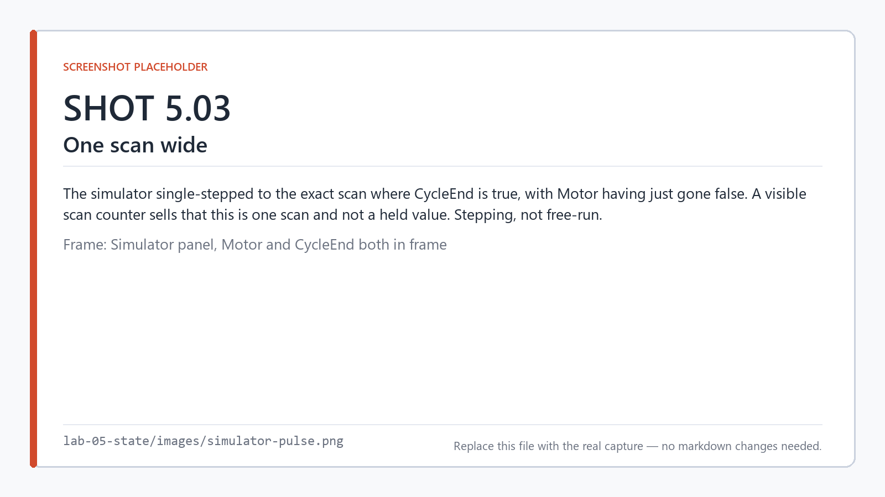
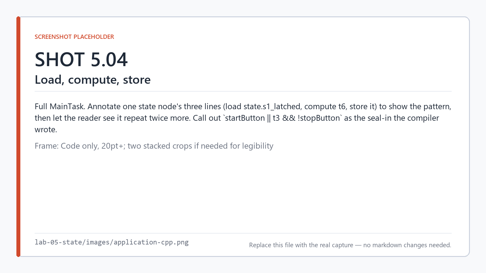
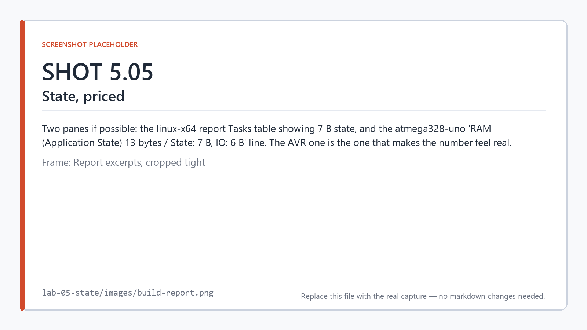
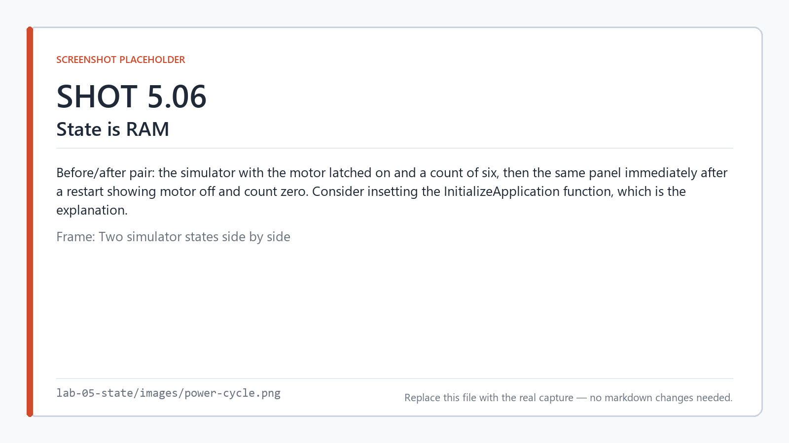

# Lab 5 — State: latches, counters, and edges

**Time:** 25 minutes · **Hardware:** none · **License tier:** Free

**Previous:** [Lab 4 — Types and ports](../lab-04-types/) · [Series index](../README.md)

---

## The problem

A motor start/stop station. Two momentary pushbuttons: press Start and the motor runs and *stays*
running; press Stop and it stops. Count completed runs, and raise a batch-complete signal at ten.

```
Motor         latches on Start, off on Stop
BatchComplete after 10 runs
CycleEnd      a one-scan pulse each time the motor stops
```

Everything you have built so far has been **combinational** — the outputs this scan depend only on
the inputs this scan. This is the first lab where the program has to *remember* something.

And it is the lab where the error from Lab 2 pays off. When you created a feedback loop there, the
compiler said:

```
Feedback loops require a state-bearing node, which does not exist yet.
```

Now you are going to add one.

## What you'll learn

- Why the ladder seal-in pattern is rejected, and what to use instead
- `set-reset`, `counter`, `toggle`, `rising-edge`, `falling-edge`
- Where retained state lives in the generated C++, and what it costs in bytes
- That `counter` and `toggle` detect edges themselves — and when you still need an edge node
- The difference between surviving a scan and surviving a power cycle

<!-- shot 5.01 -->


*Three state-bearing nodes: the latch, the counter, and the edge detector.*

---

## Build it

```
smflow new lab-05.smflow --name "Lab 05 - State"
```

### 1. First, the way you already know

If you write ladder, your hand is already moving. The seal-in:

```
Motor = (Start OR Motor) AND NOT Stop
```

The motor's own state is fed back into the rung that computes it. Draw it literally — an `or`, a
`not`, an `and`, and a wire from the `and` output back to the `or` input.

It is also shipped as [`sealin-attempt.smflow`](sealin-attempt.smflow) if you would rather see the
error than build it:

```
smflow validate sealin-attempt.smflow
```

```
error SMF0007: The graph contains a cycle involving 'seal', 'run', 'motor'.
Feedback loops require a state-bearing node, which does not exist yet.
```

<!-- shot 5.02 -->


*The ladder reflex, and the compiler's answer.*

In ladder this works because the PLC runtime has an implicit memory: the coil's value persists
between scans, so reading it is reading last scan's result. The rung is cyclic on paper and
sequential in time.

SMFlow will not infer that for you. A cyclic graph has no topological order, and rather than pick
one and quietly introduce a scan of delay, it refuses and tells you what is missing. **If a value
has to survive a scan, say so.** That is the whole lesson, and the rest of this lab is the
vocabulary for saying it.

Delete those four nodes.

### 2. The latch

```
smflow add-node lab-05.smflow digital-input  --id start --name StartButton
smflow add-node lab-05.smflow digital-input  --id stop  --name StopButton
smflow add-node lab-05.smflow set-reset      --id latch
smflow add-node lab-05.smflow digital-output --id motor --name Motor

smflow connect lab-05.smflow start:value latch:S
smflow connect lab-05.smflow stop:value  latch:R
smflow connect lab-05.smflow latch:Q     motor:value
```

`set-reset` has two inputs, `S` and `R`, and one output `Q`. Both inputs are **required** — you
cannot leave `R` dangling. If you genuinely never reset something, you wire a false constant to it
(the variable-with-an-initial-value idiom from Lab 3). Making you say "never" explicitly is better
than letting you forget to say anything.

### 3. The counter

```
smflow add-node lab-05.smflow digital-input  --id rstcnt --name ResetCount
smflow add-node lab-05.smflow counter        --id cnt
smflow add-node lab-05.smflow digital-output --id batch --name BatchComplete

smflow connect lab-05.smflow latch:Q      cnt:CU
smflow connect lab-05.smflow rstcnt:value cnt:R
smflow connect lab-05.smflow cnt:Q        batch:value
```

Set the counter's **Preset count** property to `10`.

`counter` has `CU` (count up) and `R` (reset) in, and `Q` (reached preset) and `CV` (current value)
out. `CV` is an `int32` — we are not using it here, but it is there, and the exercise uses it.

Notice what `CU` is wired to: the latch output directly. The motor being *on* is a level, not a
pulse, and it stays on for thousands of scans. You might expect the counter to run away. It does
not, and section **Look at the code** shows you exactly why — it is worth seeing rather than being
told.

### 4. The edge pulse

```
smflow add-node lab-05.smflow falling-edge   --id fe
smflow add-node lab-05.smflow digital-output --id pulse --name CycleEnd

smflow connect lab-05.smflow latch:Q fe:IN
smflow connect lab-05.smflow fe:Q    pulse:value
```

`falling-edge` emits `true` for exactly one scan, on the scan where its input went from true to
false. `rising-edge` is its mirror.

`CycleEnd` is therefore a 10 ms pulse each time the motor stops — the kind of thing you would wire
to a downstream counter, a data-logging trigger, or a handshake line.

### 5. Validate

```
smflow validate lab-05.smflow
```

```
Lab 05 - State: valid.
```

---

## Run it

```
smflow simulate lab-05.smflow
```

Press and release `StartButton` — a momentary press, on then off. The motor comes on and **stays**
on. That is the latch.

Press and release `StopButton`. The motor stops, and `CycleEnd` flashes for a single scan — blink
and you will miss it, so step the simulator rather than running it free.

Do that ten times. `BatchComplete` comes on. Press `ResetCount` and it clears.

<!-- shot 5.03 -->


*The one scan where `CycleEnd` is true. Single-step to catch it.*

Try pressing Start and Stop at the same time. The motor runs — **Set wins**. Hold that thought.

---

## Look at the code

```
smflow build lab-05.smflow --target linux-x64 --emit-only
```

```cpp
void MainTask(IO& io, State& state)
{
    const bool startButton = io.StartButton;
    const bool stopButton = io.StopButton;
    const bool resetCount = io.ResetCount;
    const bool t3 = state.s1_latched;
    const bool t6 = startButton || t3 && !stopButton;

    state.s1_latched = t6;
    io.Motor = t6;
    const int32_t t7 = state.s2_count;
    const bool t8 = state.s2_previous;
    const int32_t t13 = resetCount ? 0 : t6 && !t8 ? t7 + 1 : t7;

    state.s2_count = t13;
    state.s2_previous = t6;
    io.BatchComplete = t13 >= 10;
    const bool t15 = state.s3_previous;

    state.s3_previous = t6;
    io.CycleEnd = t15 && !t6;
}
```

<!-- shot 5.04 -->


*Load state, compute, store state. Three times.*

### The compiler wrote your seal-in

Look at the latch line:

```cpp
const bool t6 = startButton || t3 && !stopButton;
```

Where `t3` is `state.s1_latched` — last scan's value.

That is **exactly** the seal-in you were refused in step 1. `Motor = Start OR (Motor AND NOT
Stop)`. The compiler wrote it for you, with the feedback resolved explicitly against retained
state rather than against an unordered cycle.

This is the point of the whole lab. SMFlow did not object to the *logic*. It objected to you
expressing it as a loop, because a loop does not say **which scan** the fed-back value comes from.
The `set-reset` node says it: last scan's. Same program, no ambiguity.

And now you can answer the dominance question from the code rather than from a datasheet: if `S`
and `R` are both true, `startButton ||` short-circuits to true. **`set-reset` is Set-dominant.** It
is not a property you can change — if you need Reset-dominant behavior, you build it, and it is
visible on the canvas.

### Load, compute, store

Every state-bearing node follows the same shape:

```cpp
const bool t3 = state.s1_latched;     // load last scan's value
const bool t6 = startButton || ...;   // compute this scan's
state.s1_latched = t6;                // store it for next scan
```

No hidden mechanism. The value lives in a struct, it is read at the top of the node's code and
written at the bottom, and the write happens in the same scan as the read. There is no deferred
commit and no shadow copy.

### Why the counter does not run away

Here is the thing you were told to watch for:

```cpp
const bool t8 = state.s2_previous;
const int32_t t13 = resetCount ? 0 : t6 && !t8 ? t7 + 1 : t7;
...
state.s2_previous = t6;
```

`t6 && !t8` — current value true, previous value false. **The counter detects the rising edge of
`CU` itself.** It carries its own `previous` bool for exactly that purpose. Wiring a level to `CU`
is correct and counts transitions, not scans.

`toggle` does the same with its `CLK` input. So does the compiler's handling of `serial-tx`'s send
trigger, which you saw in Lab 4.

Which raises a fair question: **when do you actually need a `rising-edge` node?**

When you need the pulse **as a value** — something you can wire to a plain boolean consumer that
does not edge-detect for itself. Our `CycleEnd` output is exactly that case: a physical pin that
must be high for one scan. An `or` node, a `select`, a `digital-output` — none of those have an
opinion about edges, so if you want an edge you make one.

If you had added a `rising-edge` between the latch and the counter, it would have worked and been
redundant: the generated code would carry two `previous` bools instead of one, and the extra byte
would be pure waste. **The generated code is where you find that out.** This is a concrete reason
to read it even when everything works.

> Note the counter's reset is dominant — `resetCount ? 0 : ...` is evaluated first. Opposite
> precedence to the latch, and again, readable straight off the source.

### Where the state lives

`application.h`:

```cpp
struct State
{
    bool s1_latched;
    int32_t s2_count;
    bool s2_previous;
    bool s3_previous;
};
```

One struct, one slot per state-bearing node, named by execution order. And it is initialized
explicitly:

```cpp
void InitializeApplication(State& state)
{
    state.s1_latched = false;
    state.s2_count = 0;
    state.s2_previous = false;
    state.s3_previous = false;
}
```

In `main.cpp` it is an ordinary local:

```cpp
smflow::State state = {};

smflow::InitializeHardware();
smflow::InitializeApplication(state);
```

**No heap. No allocation. No pointers.** It is a plain struct in automatic storage, zeroed and then
explicitly initialized. On a microcontroller target the same struct is a file-scope object, because
Arduino calls `loop()` once per iteration — the generated code says so in a comment:

```cpp
// Static rather than local to loop(): Arduino calls loop() once per iteration,
// so anything that has to survive a scan lives out here.
smflow::IO io = {};
smflow::State state = {};
```

### What it costs

The build report prices it:

```
  Task        Period      Nodes   Ops   State Size
  Main        10 ms       9       25    7 B
```

Seven bytes — one `int32` and three `bool`. Build the same project for an Uno and the report adds
the context that matters on a part with 2 KB of RAM:

```
  RAM (Application State)  13 bytes    [statically calculated]
    Note: State: 7 B, IO: 6 B, Shared: 0 B
```

<!-- shot 5.05 -->


*State is a number you can know before you flash anything.*

Worth doing yourself:

```
smflow build lab-05.smflow --target atmega328-uno --emit-only --out avr
diff avr/*/application.cpp generated/application.cpp
```

The `MainTask` function is **byte-identical** between an x86-64 Linux binary and an ATmega328P
sketch. Only the scaffolding around it differs. That is Lab 9's subject, arriving early and
unannounced.

---

## Break it

### Leave a reset unconnected

Delete the wire into `latch:R`:

```
error SMF0005: Required input 'R' on Set/Reset node 'latch' is not connected. [node latch]
```

A latch you cannot clear is almost always a mistake, so `R` is required. If you really mean it,
wire a false constant and the intent is on the canvas where a reviewer can see it.

### Power-cycle it

This one has no error message, and it is the most important thing in the lab.

Run the simulator. Latch the motor on, run up a count of six. Now **stop the simulator and start it
again.**

Motor off. Count zero.

<!-- shot 5.06 -->


*Scan-to-scan state does not survive a restart. By design, and you can see why in the code.*

You already know why, because you read `InitializeApplication`. It sets every slot to its initial
value, unconditionally, on every startup. There is nowhere for the old value to have come from —
`State` is a plain struct in RAM.

**State in SMFlow survives a scan. It does not survive a power cycle.** Those are two completely
different mechanisms, and conflating them is the single most common mistake people make coming
from a PLC with battery-backed memory.

If you need a value to come back after a reboot, you declare it as a **retained shared variable**
and SMFlow puts it in flash, EEPROM, or NVS depending on the target — and makes you trigger the
write, because flash wears out. That is [Lab 11](../README.md), and now you know what question it
answers.

---

## On your own

Rebuild the station with a **single** button: press it once to start, again to stop. Keep the
counter and the pulse, and keep a dedicated `StopButton` that forces the motor off regardless.

Use `toggle` — ports `CLK` and `R` in, `Q` out — in place of the `set-reset`.

Then, from the generated code:

1. `toggle` carries *two* state slots where `set-reset` carried one. What is the second one for,
   and why does `set-reset` not need it?
2. Is `toggle`'s reset dominant or subordinate? Prove it from the emitted expression, not by
   experiment.
3. The state size went from 7 bytes to 8. Where did the extra byte go?

A finished version is in [`solution/`](solution/).

---

## What just happened

**A cycle in the graph is not memory — it is an unanswered question.** "Where does this value come
from?" has two possible answers, this scan or last scan, and a picture of a loop does not say
which. A state-bearing node says it, which is why the compiler insists on one.

**State-bearing nodes compile to load / compute / store against a plain struct.** No heap, no
allocation, no hidden runtime. You can read every byte of it in `application.h`, and the build
report prices it before you flash.

**Several nodes detect edges for you.** `counter` on `CU`, `toggle` on `CLK`. Explicit
`rising-edge` and `falling-edge` nodes are for when you need the pulse as a *value* — to drive a
pin, feed an `or`, or hand to anything that has no opinion about edges. Adding one where it is not
needed is not an error; it is a wasted byte that only the generated code will tell you about.

**Dominance is readable, not memorized.** `set-reset` is Set-dominant and `counter`'s reset is
dominant, and you established both by reading one line of C++ each. When behavior is a property of
emitted source rather than of documentation, the documentation cannot drift.

**Scan-to-scan is not power-cycle.** `State` is RAM, initialized on every boot. Retention is a
different mechanism with a different cost, declared differently, and deliberately explicit.

---

**Previous:** [Lab 4 — Types and ports](../lab-04-types/) ·
**Next:** Lab 6 — Timers · [Series index](../README.md)
